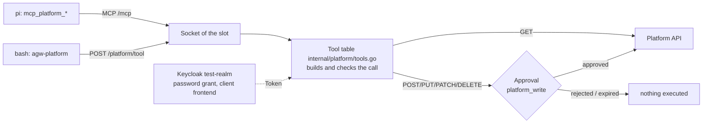

# PoC: Agent in an isolated sandbox, orchestrator in Go

> **Origin:** These notes come from the master's thesis repository (there `poc/README.md`). Paths such as
> `poc/…` refer to this repository, `../docs/…` and `../masterarbeit/…` to the thesis repository.

> **As of 2026-09-29, decision of the author.** This folder records how the first PoC is
> built. **Stage 1 is implemented** (see *Stage 1 (implemented)* directly below); the
> sections after it describe the target architecture. The choice of pi as the harness is justified in
> [`docs/poc-pi.md`](../docs/poc-pi.md); the role of the PoC in the thesis is described in
> [`masterarbeit/gliederung.md`](../masterarbeit/gliederung.md) (5.1, 5.3, 5.4, 6.2, 6.3).
>
> **Do not confuse:** `prototyp/` is the UI design mock-up, `poc/` the runnable system.

## Stage 1 (implemented)

As of 2026-09-29. Runs on the Mac with Docker Desktop; tested end to end with DeepSeek V4.1
Flash (`deepseek/deepseek-flash`). Since 2026-10-05 with a binding to the platform via MCP and CLI,
token exchange per chat and uploads (see *Platform binding (direct)*). The next steps
(delegation, REST variant, chat in the platform) are described in
[`plan-delegation-rest-platform.md`](plan-delegation-rest-platform.md).

### Starting

```bash
cd poc
./dev.sh init      # .env from .env.example (random values), build images, npm install
# enter DEEPSEEK_API_KEY in poc/.env (.env is never versioned, .env.example is)
./dev.sh start     # build sandbox image, start orchestrator + Postgres + RustFS + package caches, with hot reload;
                   # prints the login link of the web UI (/login?token=…)
./dev.sh start --prod   # the same with the fixed orchestrator image, without hot reload
./dev.sh status    # services, sandboxes, pool
./dev.sh cli run "Write a Python script …"     # CLI agw, answer streamed
./dev.sh test      # fast tests, about 25 s: Go (unit, Postgres, -race) and web (Vitest)
./dev.sh test --full  # additionally Docker integration, S3 and slot tests, about 5 min (before pushing)
./dev.sh e2e       # end to end with the real model (amounts in cents), incl. auto-compaction
./dev.sh stop      # stop, tear down sandboxes, data is kept
./dev.sh reset     # delete EVERYTHING (volumes with chats and artifacts, networks, images); asks first
```

| What | Address |
|---|---|
| Web UI with hot reload (after `./dev.sh start`) | <http://127.0.0.1:18484>, Vite forwards `/api` and `/login` to the orchestrator |
| Web UI and API | <http://127.0.0.1:18480>, log in once via `/login?token=<AGW_API_TOKEN>` (API contract: [`API.md`](API.md)); CLI and tests send the token as `Bearer` |
| RustFS console | <http://127.0.0.1:18483> (credentials from `.env`) |
| Postgres | `127.0.0.1:18482`, user and database `agwpoc` |
| LLM proxy | `orchestrator:18481`, only in the sandbox network |
| Package caches | `http://npm-cache:4873/` (Verdaccio) and `http://pip-cache:5000/index/` (proxpi), **only from a sandbox with internet**; no ports on the host |

**Hot reload.** `./dev.sh start` runs the orchestrator from source: the container
(`golang:1.26-bookworm`, `compose.hot.yaml`) mounts `poc/` read-only, and
`dev/go-hot.sh` rebuilds on every change to Go files, `go.mod`/`go.sum` or `schema.sql`
(about 1 s with the build cache in a volume) and restarts the orchestrator. If the build fails, the
old version keeps running. A restart puts running chats into idling; they can be resumed. Vite serves
the web UI on `:18484` with hot module replacement; the login cookie applies to both
ports, because cookies do not distinguish by port. `:18480` still serves the embedded
version (state of `web/dist`). The mode is remembered in `.dev/mode`, so that `stop`, `logs`,
`test` and `e2e` use the same Compose files.

All ports, networks (`10.231.18.0/24` internal, `10.231.20.0/24` egress, `10.231.21.0/24` outbound for the package caches, one `/28` per slot from `10.231.128.0/17`), volumes and names carry the prefix `agwpoc` and are
deliberately chosen to be unusual, so that nothing collides with other services.

### Components

| Path | Content |
|---|---|
| `cmd/orchestrator` | wires everything together; on start it cleans up sandboxes from earlier runs and sets active chats to *idle* |
| `cmd/agw` | CLI against the API (`run`, `chat …`, `pool`, `approve`, `watch` …) |
| `cmd/agw-artifact` | helper CLI **inside** the execution sandbox, speaks HTTP over its socket |
| `cmd/agw-exec` | static helper in both containers of a slot (E9): supervisor of the execution sandbox (including the operation `workflow` for workflow scripts), entrypoint of pi without a shell, reading sessions and subagents |
| `internal/execproto`, `internal/execbox` | protocol to the supervisor and the orchestrator's client (one connection per slot) |
| `internal/bgtask` | background tasks of a slot (bash with `run_in_background`): start, following the output until the end, retrieval, stop |
| `internal/fakellm` | scripted model for the slot integration test (E9) |
| `internal/rpc` | pi RPC client (framing only at `\n`, long lines, oversized lines are reported) |
| `internal/sandbox` | hardened containers via the Docker API, `exec`, long-lived `exec` for the supervisor, internet switch |
| `internal/pool` | warm pool per variant, single-use assignment |
| `internal/worker` | one slot = two containers (pi, execution sandbox) + two sockets; tool set per variant |
| `internal/sock` | sockets per slot: for pi `/tool/*` (E9, also `/tool/workflow`) and `/mcp`, in the execution sandbox `/artifacts`, `/internet` and `/mcp` (`ping`, `list_artifacts`, `upload_artifact`) |
| `internal/chat` | chats, events, sessions, idling/resuming, workspace per chat, artifacts, confirmation |
| `internal/store` | Postgres (chats, messages, session, artifacts, approvals, socket log) |
| `internal/artifacts` | RustFS (S3) and approval broker |
| `internal/llmproxy` | proxy to the model provider with key and model allowlist |
| `internal/api` | HTTP API, SSE, block for requests from the sandbox networks, embedded UI |
| `web/` | React 19, Vite, Tailwind 4, shadcn/ui |
| `images/agw-basis` | one Dockerfile, two images (E9). `agw-pi` (`--target pi`): Node.js 24 LTS, pi 0.87.1, pi-subagents as our own copy from `third_party/pi-subagents` (0.73.1-agw.2, dependencies via `npm ci` from `pi-subagents-deps/package-lock.json`), rpiv-todo 2.11.0, extensions, skills, `agw-exec`; **without a shell, without `git` and without Python**; `PI_SUBAGENTS_WORKFLOW_WORKER` points to `ext/remote-worker.mjs` (`workflowScript`, E9). `agw-basis` (`--target exec`, execution sandbox): Debian (`node:24-bookworm-slim`), Python 3.11 with numpy, pandas, matplotlib, jinja2, plotly, openpyxl; Typst 0.14.2 with a fixed package selection (`typst/packages.txt`); skills `writing-typst`, `charts` (matplotlib, `MPLBACKEND=Agg`) and others; curl, jq, ripgrep, fd (for `find`, like pi), git, unzip, zip, tar, xz, bzip2, file, poppler-utils (`pdfinfo`, `pdftotext`, `pdftoppm`), binutils (`strings`); `agw-artifact`, `agw-exec`, runtime for workflow scripts (`workflow/runner.cjs`); **without pi**. In addition the test image `agw-parity` (`--target parity`, execution sandbox plus pi), used only for the parity test |
| `third_party/pi-subagents` | our own copy of pi-subagents 0.73.1 (MIT) as `0.73.1-agw.2` with two changes (origin of the worker for `workflowScript` configurable; output of the children in the answer instead of as a file); origin, change and tests in `VENDORED.md`. The pi image is built from it; `images/agw-basis/pi-subagents-deps` pins the dependencies with a lockfile |
| `pkgcache/verdaccio.yaml` | settings of the npm cache (read-only, no login, no publishing) |
| `models.json` | model catalogue: models, tariff (peak hours), optionally custom prices |
| `e2e/` | end-to-end tests against the running stack (`./dev.sh e2e`) |

### Origin: what is our own and what is taken over

For the assessment it should be recognisable at any time what in the PoC is our own work and what
comes from third-party sources. Principle: **third-party code enters the repository unchanged in a
commit of its own; our own changes to it follow in a separate commit** and are described in a file next to the
code. What is only installed at build time is not in the repository.

| Part | Origin | In the repo? | Own changes |
|---|---|---|---|
| Orchestrator (`cmd/`, `internal/`), `agw-exec`, CLI `agw`, web UI (`web/src` except `components/ui`), extensions `exec-bridge.ts`, `mcp.ts`, `remote-worker.mjs`, `workflow/runner.cjs`, images, `compose.yaml`, `dev.sh`, all tests | **own** | yes | – |
| Background tasks (`internal/bgtask`, operation `bg` in `agw-exec`, `bg_output`/`bg_stop` in `exec-bridge.ts`, `web/src/components/BackgroundTasks.tsx`) | **own**, modelled on the behaviour of Claude Code; the extension `pi-background-tasks` (npm, ISC) is **not** taken over (see *Background tasks*) | yes | – |
| `third_party/pi-subagents` | npm package `pi-subagents` 0.73.1 (MIT) | yes | original in commit `d21c5c0`, own changes in `8dfbd4a`; described in [`VENDORED.md`](third_party/pi-subagents/VENDORED.md), visible with `git diff d21c5c0 8dfbd4a -- poc/third_party/pi-subagents` |
| `web/src/components/ui/*` | templates from shadcn/ui (MIT), generated by the shadcn CLI | yes | not recorded separately: the components entered the repository together with our own code (from commit `ebcff73`); deviations from the templates can only be determined by regenerating and comparing |
| `images/agw-basis/skills/writing-typst/SKILL.md` | skill of the author (from `~/.claude/skills`), extended by the section “In this sandbox” | yes | the section mentioned |
| `images/agw-basis/skills/writing-typst/references/` | documentation of the Typst project (github.com/typst/typst, folder `docs`, Apache-2.0) | yes | none |
| Web search: web proxy (`internal/webproxy`), `web-gate.ts`, `searxng/settings.yml`, table `web_requests` | **own** | yes | – |
| `pi-searxng-suite` 0.2.3 (MIT, tools `web_search` and `web_extract`) | npm | no, at build time via `pi install` (fixed version) | none; showing and hiding the tools and forwarding are handled by `web-gate.ts` and the web proxy |
| `third_party/pi-intercom` | npm package `pi-intercom` 0.15.0 (MIT) | yes | original in commit `4ce9ca6`, own change in `31a8495`; described in [`VENDORED.md`](third_party/pi-intercom/VENDORED.md), visible with `git diff 4ce9ca6 31a8495 -- poc/third_party/pi-intercom` |
| pi (`@earendil-works/pi-coding-agent` 0.87.1), `@juicesharp/rpiv-todo` 2.11.0, Python and npm packages, Typst and Typst packages | npm, PyPI, GitHub | no, installed at build time (fixed versions in the Dockerfile) | none |
| npm dependencies of the web UI (`web/package.json`, among others React, react-markdown, shadcn/radix, `mermaid` 12.0.0 (MIT) and `dompurify` 3.4.16 (MPL-2.0 or Apache-2.0) for the diagrams, `pdfjs-dist` 6.3.289 (Apache-2.0) for the PDF preview) | npm | no, only `package.json` and `package-lock.json`; `mermaid` and `dompurify` at fixed versions, bundled at build time into a separate chunk of `web/dist` that is loaded only on demand | none |
| Postgres, RustFS, Verdaccio, proxpi, SearXNG (AGPL-3.0, separate service, unchanged), Node, Go and Debian images | Docker Hub and others | no, only by name/digest in `compose.yaml` or the Dockerfile | configuration is our own (`compose.yaml`, `pkgcache/verdaccio.yaml`, `searxng/settings.yml`) |

### Comparison with the decisions

| # | Status in stage 1 |
|---|---|
| E1 | hardened containers implemented: `--read-only`, `--cap-drop=ALL`, `no-new-privileges`, uid 10001, memory, CPU and PID limits. Since E9 two per slot: the pi container with tmpfs for `/agent`, `/home/agent`, `/tmp`; the execution sandbox with tmpfs for `/workspace`, `/home/agent`, `/tmp` and additionally `SETUID`/`SETGID` and `KILL` only for its supervisor (the agent's processes have no capabilities; `KILL` is needed by the emergency brake when the process limit is exhausted). gVisor is dropped for the thesis (2026-10-05, outlook) |
| E2 | implemented: pi in RPC mode in the sandbox |
| E3 | **deviating:** the pi container is attached to a **dedicated** internal network `agwpoc_slot_<slot>` (`internal: true`) that contains only it and the orchestrator; through it, it reaches only the LLM proxy and (since 2026-09-30) the web proxy for web search, which only lets traffic through when internet is switched on (*Web search*). The execution sandbox (E9) has its own internal network `agwpoc_slot_<slot>_x` without the orchestrator; it reaches neither the API nor the proxy. **Internet is off by default.** The agent can request it with a justification (`agw-internet`, MCP `request_internet`); the user confirms in the UI, only then does the orchestrator connect the execution sandbox to `agwpoc_egress` and attach the package caches to its network. The user can also flip the switch per chat themselves. Model traffic goes over the internal network, **not** over the socket |
| E4 | implemented for artifacts and MCP: one socket per slot in the volume `agwpoc_sockets`, only the slot's own directory mounted via subpath; the chat follows from the socket alone; unassigned slots answer “not assigned” |
| E5 | implemented: orchestrator in Go, holds keys, sessions and log |
| E6 | `agw-basis` implemented, by tag instead of digest (sufficient for stage 1); `agw-ml` is still missing |
| E7 | implemented: target size per variant (`AGW_POOL_SIZE_CLI/MCP/BOTH`), single-use assignment, refilling |
| E8 | implemented via Postgres instead of a host directory (as the later integration intends): the session file is saved after every turn, placed into the fresh sandbox via `exec` on resume and loaded with `switch_session`; in addition `/workspace` as an archive in RustFS (*Workspace per chat*) |
| E9 | **implemented** (2026-09-29): a slot consists of two containers. pi runs without a shell; `exec-bridge.ts` routes all tools (`bash`, `read`, `write`, `edit`, `grep`, `find`, `ls`) of the main agent and the subagents over the socket to the orchestrator, which executes them in the execution sandbox and logs them in `tool_executions`; the proxy records the requested `toolCallId`s, and the two are reconciled. A guard blocks custom agents and foreign runtimes (bypasses found with the prototype); the scripts of `workflowScript` run in the execution sandbox instead of in the pi process, which makes chains and parallel subagents possible again. The findings of the code and security reviews have been incorporated. Details, measurements, reviews and deviations: [`e9-execution-sandbox.md`](e9-execution-sandbox.md) |

### Default environment

- **Working directory, home and `/tmp` are executable** (tmpfs with `exec`). Otherwise Docker mounts tmpfs
  with `noexec`; then compiled Python packages from `~/.local` could not be loaded
  (“failed to map segment from shared object”). `noexec` protects nothing here, because the agent
  executes code with `bash` anyway.
- **Preinstalled instead of downloaded later:** internet is off by default, so `pip install` and
  `npm install` mostly do not work. With internet they go through the package caches
  (see below). Global npm packages end up in `~/.local` (`NPM_CONFIG_PREFIX`),
  which is on the `PATH`.
- **Typst only with built-in packages:** the packages from `images/agw-basis/typst/packages.txt`
  are downloaded into `/opt/typst/packages` at build time (`TYPST_PACKAGE_CACHE_PATH`); the location is
  read-only at runtime. Other packages therefore cannot be loaded even with internet
  (checked in the integration test). New packages belong in the list and in the image.
- **Charts with matplotlib** (skill `charts`, variants `cli` and `both`): numpy, pandas and
  matplotlib are baked into the image, `MPLBACKEND=Agg` is set; the font cache is created on the
  first import in the writable home (about 0.5 s). The skill prescribes defaults (size,
  axes with units, decimal comma via a formatter because there is no German locale, `tab10`
  or `viridis`) and displays the PNG via Markdown (see *Display images in the chat*). plotly is
  installed together with kaleido and writes PNG via the sandbox's Chromium (`BROWSER_PATH`); the skill
  nevertheless prefers matplotlib. **Mermaid as a file** (since 2026-09-30): `mmdc` (Mermaid CLI 12, like
  the web UI) with Chromium from Debian, as a wrapper with `--no-sandbox` and `--disable-dev-shm-usage`
  (`/opt/agw/mmdc/puppeteer.json`); about 1 s per diagram, checked without internet, as uid 10001 with a
  read-only file system. The system note mentions it for `cli` and `both` as a fallback,
  the skill `mermaid` describes the invocation. Chromium and mermaid-cli make the image about 1.1 GB
  larger (810 MB → 1.9 GB). For diagrams in Typst it points to cetz/cetz-plot and lilaq. The
  Docker integration test creates a matplotlib PNG without internet and checks the magic bytes.

### Variants in stage 1

| Variant | Tools |
|---|---|
| `cli` | pi's standard tools, `pi-subagents`, task list `todo`, skills `artifacts` (`agw-artifact`), `internet` (`agw-internet`), `platform` (`agw-platform`), `writing-typst` and `charts` |
| `mcp` | `--tools read,write,ls,mcp_ping,mcp_list_artifacts,mcp_upload_artifact,mcp_request_internet,mcp_platform_*,todo`: **no** `bash`, **no** subagents |
| `api` | only `platform_http` (the platform's REST API over the socket), plus `todo`, `web_search`, `web_extract`: **no** `bash`, **no** file tools |
| `both` | the tools of `cli` and `mcp` together |

The MCP variant gets no subagents, because the subagent `worker` would otherwise bring `bash`
back and circumvent the variant's scope of action.

Since E9 every variant loads `exec-bridge.ts`: the tools it has (in the MCP variant
`read`, `write`, `ls`) run via the orchestrator in the execution sandbox. This gives all
variants the same observation point, which the comparison of bindings needs. The tool set per
variant is the same as before.

### Models, prices and tariff

- **Prices come from pi's own model registry** (`get_available_models`; pi 0.87.1 knows
  `deepseek-flash` including prices and DeepSeek-specific `compat` settings). The catalogue
  marks such models with `pi_builtin`; the generated `models.json` then only redirects `baseUrl`
  and key to the proxy and does **not** redefine the model. Custom prices in the catalogue
  take precedence (for models pi does not know).
- **Peak and off-peak tariff:** pi knows only one price per model. The orchestrator re-bills every
  answer according to the provider's tariff at the time of the answer (DeepSeek: Mon–Fri
  01:00–04:00 and 06:00–10:00 UTC peak, otherwise half price) and stores cost and tariff per
  answer; pi's own value is kept in `usage.cost` for comparison. Chinese public holidays (off-peak
  there) are not known and count as peak.
- **The costs at the LLM proxy are authoritative.** It assigns every model call to a chat via the source address
  in the slot network, reads tokens, response ID and requested tool calls from the
  provider's response and bills according to the tariff (table `llm_calls`). This includes subagents,
  compactions and direct calls from the sandbox; the share outside the
  answers of the main session is shown as `cost_other` on the chat. The proxy rejects calls from addresses
  that do not belong to an assigned slot.
- **Cache:** DeepSeek caches prefixes automatically. pi's system prompt is stable (no time of day, `cwd`
  always `/workspace`), the orchestrator's addition is static; measured, even the first
  answers of a new chat hit about 90 % of the input in the cache. The UI shows the ratio per answer.

### Context, commands and compaction

- **Context usage** from `get_session_stats.contextUsage`, stored after every turn and every
  compaction (also visible for idle chats); the UI shows a ring with a tooltip.
- **Slash commands:** built in are `/compact [instructions]` and `/autocompact on|off`; in addition pi's
  commands (`get_commands`: skills such as `/skill:artifacts`, prompt templates, extension commands),
  which are sent to pi as a message.
- **Compaction** (manual and automatic, switch per chat): each one is stored as its own entry
  and **billed** (the summary is a separate model call that does not appear in any
  answer). Threshold via `AGW_COMPACT_RESERVE_TOKENS` (pi: `compaction.reserveTokens`).
  Manual summaries get the instruction “in the language of the conversation”; pi writes the automatic one
  in English, because its prompt cannot be influenced over RPC.

### Subagents: visible, billed, limited

**Subagents may do what the main agent may do** (decision of the author, 2026-09-30): all
built-in agents of pi-subagents (including `researcher`, `reviewer`, `evidence-auditor`) get the same tools via
`agentOverrides` (`worker.SubagentTools`): `read`, `grep`, `find`, `ls`, `bash`,
`edit`, `write`, `bg_output`, `bg_stop`, `web_search`, `web_extract`, `contact_supervisor`; excluded
are further subagents (depth 1) and the task list. The trigger was a run with four `researcher`s
that had only `read`, `write` and `contact_supervisor`: their tools `fetch_content` etc. come from
a different package (pi-web-access), and pi-subagents does not pass on extensions loaded via `-e`.
Web search therefore comes together with `web-gate.ts` via `defaultSubagentOnlyExtensions`. Child sessions in the
foreground run in pi's Node process and share its open tunnels to the web proxy; their requests
then appear under the main agent's tunnel in `web_requests` (`TestSlotWebSearch` demonstrates the search
of a `researcher` against the emulated SearXNG).

**Name and state per run** (2026-09-30). The session folders of the children carry their own identifier, not
the run identifier of pi-subagents; the names from `subagent-artifacts/<run>_<agent>_input.md` could
therefore not be assigned for runs in the background, and all were just called “Subagent”. The link is
in the status files `/tmp/pi-subagents-uid-*/async-subagent-runs/<run>/status.json` (field `sessionFile`
per step, plus `agent`, `workflowKey` or `label`, and `state`). `agw-exec poll-subagents` reads them along,
the orchestrator stores them in `subagent_runs` (event `subagent_run`), and the UI shows the name
from the workflow (for example `reid`) together with the agent. The status follows pi-subagents' `state`; before,
it was estimated from the entries and showed “ended without an answer” for runs in the background
as soon as the main agent went idle, although they kept working. Without a status file (foreground) the agent comes
from `session_info` of the child session (“researcher: …”). All of this comes from the sandbox, so it is not tamper-proof.
The system note asks for short, descriptive keys.

**Output paths of the children.** pi-subagents prescribes an output path for children under
`/agent/sessions/subagent-artifacts/outputs/…`, which their tools in the execution sandbox cannot
reach; in the chat “Recherche Schwanzbeißen” (tail-biting research) all three `researcher`s failed because of this with `mkdir: … Read-only
file system`. Our own change 4 to the copy (`PI_SUBAGENTS_OUTPUT_INLINE=1`, `VENDORED.md`) makes them
return the result in the answer instead; pi-subagents stores it itself.

**In the background, and pi's turns.** The system note suggests to the agent to start longer
subagent work with `async: true`; it is then free immediately, and the user can keep talking.
When a subagent is finished, pi-subagents posts a message (role `custom`) and starts a
turn with it itself (`triggerTurn`). The orchestrator recognises such turns by an `agent_start` without
its own request and records them as a **wake-up** (`chat_turns`, `trigger` wake, origin system, source
`pi`); the note appears with this origin in the history (UI: grey line “Note from the subagents”), and
the answers belong to this turn, not to the user's previous request. The limit
`AGW_AUTO_TURNS_MAX` applies here too: beyond it the orchestrator aborts the turn and holds back
what is enqueued. Before, it assigned such answers to the user's last request.

**Main agent and subagents talk to each other** (pi-subagents, without an extension of our own): a subagent asks
with `contact_supervisor` (`need_decision`, `progress_update`), the request arrives at the main agent as a note (role
`custom`, `subagent_supervisor_request`, with `replyTo`) and, if it is idle, starts
a turn (see above); it answers with `subagent_supervisor` (`action: "reply"`). It steers a running
subagent in the background with `subagent` (`action: "steer"`, allowed by the guard).

**Subagents also talk to each other directly** (pi-intercom 0.15.0, our own copy in
`third_party/pi-intercom`, change in `VENDORED.md`): the main agent and all subagents have the tool
`intercom` (`list`, `send`, `ask`, `reply`); the broker runs in the pi container over a Unix socket
in the home directory, so per slot, and a chat reaches no other (the cross-machine feature needs
`ssh`, which does not exist there). The original rejects messages to busy sessions without a UI,
and subagents are exactly that; the copy injects them via `steer`, as for sessions with a UI.
These messages travel inside the pi container between the sessions and not through the
orchestrator; they are visible in the session files (subagent view) and, for the main agent, as a
note in the history. Demonstrated by `TestSlotSubagentTalk` (question, answer, steering) and
`TestSlotSubagentIntercom` (subagent A finds B with `list` and writes to it, B sees the message while
working); for this, `fakellm` substitutes `{{replyTo}}`, `{{runId}}` and `{{peer}}`.

**The tool `subagent` is active from the start** (`--exclude-tools subagents_enable`).
Otherwise pi-subagents hides it behind a switch `subagents_enable`; calling it changes the
tool list in the middle of the chat, costs a model call and invalidates the prefix cache.
Measured on the same E2E test (2026-09-29): before, 8 model calls and 2 874 µ$, including a single
call with 8 607 tokens without cache (1 328 µ$); after, 6 calls and 1 233 µ$ (−57 %). The longer
prefix with the description of `subagent` already comes from the cache on the first call, because it is
the same for all chats.

- **Visible:** `pi-subagents` writes a separate session file per run (foreground and background alike)
  (`/agent/sessions/<main session>/<run>/run-N/session.jsonl`). The orchestrator reads them every
  2 s (`agw-exec poll-subagents` via `exec` in the pi container), stores request, tool calls, results and texts in
  `subagent_entries` and sends them as the SSE event `subagent`. This information comes from the
  pi container, which the agent can no longer reach since E9; it is nevertheless *corroborated* only via
  points outside: a tool call counts as corroborated if the orchestrator executed it
  (`tool_executions`, E9), other entries count as *corroborated at the proxy* if their
  `responseId` was recorded at the proxy.
- **Presentation in the web UI:** next to the chat title, “n subagents ⌄” opens the list of runs
  (status, first line of the request, tokens from the proxy or tool calls, duration); the detail view
  of a run carries breadcrumbs “Chat / Run ⇕” with the same switcher and, instead of the input field,
  the note that a subagent does not accept follow-up questions; the side tab “Subagents” shows the
  main agent with the runs as a tree joined by dashed lines, combined into an expandable group card
  from four runs per level onwards (`web/src/lib/subagent-overview.ts`).
- **Billed:** via the proxy (see above).
- **Limit `max_subagents` per chat** (default 5, at most 20, adjustable in UI and CLI, takes effect
  immediately; `AGW_MAX_SUBAGENTS_DEFAULT`, `AGW_MAX_SUBAGENTS_LIMIT`). pi-subagents runs at most four
  subagents at the same time; together with the main agent that makes five pi processes of about 75 to
  170 MiB each, which is why the pi container has 2 GiB of memory (`AGW_SANDBOX_MEMORY_MB`; the
  execution sandbox `AGW_EXEC_MEMORY_MB`, likewise 2 GiB):
  1. *hard at the proxy:* at most `1 + max_subagents` concurrent model calls of the chat, otherwise 429
     (`socket_calls.op = agent_limit`). Before E9 this also applied to calls bypassing pi, such as a second
     `pi` or `curl` started by the agent itself; since E9 only pi reaches the proxy.
  2. *hard through monitoring:* as soon as more runs have been started than allowed, the orchestrator aborts
     the turn and terminates all node processes in the pi container except pi itself
     (`agw-exec kill-node`, `op = subagent_limit`).
  3. *cooperative:* the same limit in the configuration of `pi-subagents`
     (`maxSubagentSpawnsPerSession` and others), plus `PI_SUBAGENT_MAX_DEPTH=1` (no nested
     subagents). Before E9 the agent could change this layer in the sandbox; since then the
     configuration lies in the pi container, out of its reach. It still serves mainly
     to give understandable feedback.
  4. *Guard (E9):* subagents exist individually (`agent` + `task`, built-in agents, in the
     foreground or background) and via `workflowScript`, i.e. as a chain (`runs.run`) or
     in parallel (`runs.all`). Since E9 the script runs in the execution sandbox, not in the
     pi process; the guard checks every request of the script like a single subagent, and
     pi still starts the runs. `exec-bridge.ts` blocks custom agents, foreign runtimes, `workflowScriptPath`,
     `runs.host` and `watchdog_diff`
     ([`e9-execution-sandbox.md`](e9-execution-sandbox.md), *The guard for `subagent`* and
     *`workflowScript`*).
- **Prompts from extensions** (`extension_ui_request`, for example “allow more subagents?”) are answered
  by the orchestrator with a refusal and logged (`op = extension_ui`); otherwise they would wait forever.

Demonstrated in the E2E suite: `TestSubagentsVisibleAndBilled`, `TestSubagentLimitEnforced` (with limit 0,
proxy and monitoring took effect one after the other), `TestProxyConcurrencyLimitHard`, plus
`TestE9WorkflowParallelSubagents` (three parallel runs via `workflowScript`, 4 corroborated, 1 without
sandbox, 0 suspicious, the runs overlapped by 2.7 s; run of 2026-09-29).

### Tasks

For work with several steps the agent keeps a task list with the tool `todo` of the
pi extension **`@juicesharp/rpiv-todo` 2.11.0** (MIT). Checked on 2026-09-29 (source read via
`npm pack`, downloads of the last 30 days via `api.npmjs.org`):

| Package | Licence | Downloads/30 d | pi 0.87.1 | Tools and result | State | Verdict |
|---|---|---|---|---|---|---|
| **`@juicesharp/rpiv-todo` 2.11.0** | MIT | 191 944 | peers `*` | **one** tool `todo` (`action` create/update/list/get/delete/clear); **every** result carries the complete state in `details` (`tasks`, `nextId`), even on errors | only in the tool results of the pi session, no files | **chosen** |
| `@tintinweb/pi-tasks` 0.9.0 | MIT | 5 408 | ≥ 0.80.5 | seven tools (`TaskCreate` … `TaskExecute`) with long descriptions; results text only, `details` empty | file `.pi/tasks/tasks-<session>.json` in the project folder | state cannot be reconstructed from the RPC stream, files in the workspace, many tokens |
| `pi-tasks` 0.2.7 | MIT | 1 823 | no peers | twelve tools (plan, evidence, decision …) | own session entries (`appendEntry`), not in the RPC stream | too heavy, state invisible to the UI |
| `@capdiem/pi-todo` 0.3.2 | MIT | 2 217 | peers `*` | one tool, whole list per call (saves calls) | tool results | published only minified (hard to review); writes a reminder via `before_agent_start` into the system prompt of the next round, which breaks the prefix cache |
| `@zhushanwen/pi-todo` 0.9.8 | MIT | 2 343 | peers `^0.84.4` (excludes 0.87) | one tool, `details` with list | tool results | version range does not fit |

What tips the balance for rpiv-todo is the complete state in every result (the UI needs no
replica of the logic of its own), the state in the session (it is saved in Postgres and replayed on
resume; rpiv-todo rebuilds the list from the last result at `session_start` and after compactions),
no network and no prompts. The display via `setWidget` goes out as an `extension_ui_request` in
RPC mode and is discarded by the orchestrator; the tool
works without it. Drawback: one call per change (create, to `in_progress`, to
`completed`), so about nine calls for three tasks; the tool description including eight
guidelines costs about 800 tokens per request (measured on the first model call, is in the cache).
The command `/todos` appears in the command list, but reports only via `notify` and has no
effect in the web UI.

**Integration.** In the image, like pi-subagents, via `pi install` into `/opt/agw/pihome` (fixed version,
`RPIV_TODO_VERSION`), loaded via `-e …/@juicesharp/rpiv-todo/index.ts` in **all three**
variants (`PiArgs`). In the MCP variant `todo` is additionally listed in `--tools`; the tool
only changes its own state in the session, so it does not extend the scope of action, and
all variants plan the same way, which does not distort the comparison of bindings.

**Subagents do not get `todo`** (checked on the system: the subagent named `read`,
`grep`, `find`, `ls`, `bash`, `edit`, `write`, `contact_supervisor` as its tools). pi-subagents passes to children only
“ambient” extensions from the settings and its own runtime extensions, not those of the parent loaded via
`-e`. The detail view of a run nevertheless shows a list if a
run calls `todo` (replayed from the arguments, because the subagent entries carry no `details`).

**Presentation in the web UI** (`web/src/lib/tasks.ts`, `components/Tasks.tsx`): the list is
reconstructed from the todo calls in the history, in their order; the last result with
`details` wins; without `details` the arguments of successful calls are replayed. Live,
`details` comes from `tool_execution_end.result`, after reloading from the stored
`toolResult` messages (the API returns them unchanged). Display:

1. Chat header: “3/7 tasks” with a progress ring (spinner while a task is in progress),
   only when there are tasks; a click opens the list (open ○, in progress with spinner and `activeForm`,
   done ticked and struck through).
2. Side tab “Tasks (n)” with description, dependencies and assignee.
3. In the history, consecutive todo calls of one answer are combined into a card “Tasks
   updated: 2 done, 1 in progress”; expanded, it shows the changes
   (“#2 Tests: done”) and the state afterwards. Rejected calls are marked.
4. Subagent detail view: its own list at the top if the run called `todo`.

Demonstrated by `TestAgentTaskList` (E2E, MCP variant: three tasks, nine todo results, each with
the complete state, all done at the end), `TestPiArgsTodo` and `web/src/lib/tasks.test.ts`.

### Package cache (npm, pip)

What agents fetch with `npm install` or `pip install` is collected by two Compose services, so that
it does not come from the internet anew every time. **They are reachable only while the chat
has internet**; nothing changes about the principle “internet off = no way out”.

| Service | Image | Volume | in the sandbox |
|---|---|---|---|
| `npm-cache` | `verdaccio/verdaccio:6.10.4` (by digest) | `agwpoc_npmcache` | `NPM_CONFIG_REGISTRY=http://npm-cache:4873/` |
| `pip-cache` | `epicwink/proxpi:1.3.0` (by digest) | `agwpoc_pipcache` | `PIP_INDEX_URL=http://pip-cache:5000/index/`, `PIP_TRUSTED_HOST=pip-cache` |

**Why these two.** Verdaccio is the usual npm cache and runs with a short
settings file (`pkgcache/verdaccio.yaml`). There it is **read-only**: login
(`max_users: -1`) and publishing are blocked, otherwise an agent could slip packages to other
chats; the web interface is off (checked on the running service: 409, 401, 404).
For pip, proxpi was chosen over devpi: it is a pure cache without upload, without
users and without a database, is configured via environment variables and is maintained (1.3.0 from
May 2026, last change in the repository September 2026). devpi-server can accept packages and
would need its own locks for that. By default proxpi redirects pip to
`files.pythonhosted.org` after 0.9 s if the download takes longer; the file would then bypass the
cache. `PROXPI_DOWNLOAD_TIMEOUT=120` prevents that. Both run with a
read-only root file system, without capabilities and with `no-new-privileges`.

**Network and coupling to the internet switch.** Both services are attached only to the Compose network
`agwpoc_pkg` (`10.231.21.0/24`, with internet, without ICC), not to `agwpoc_intern`: Postgres,
RustFS and the user API cannot reach them through it; `10.231.21.0/24` is additionally listed in
`AGW_BLOCKED_SUBNETS`. They cannot join the egress network, because **without ICC Docker drops
all traffic between containers there** (checked: the name resolves, the connection runs into the
timeout). Therefore `SetInternet` attaches them under the aliases `npm-cache` and
`pip-cache` to the sandbox's **slot network** when switching on, and detaches them when switching off; if detaching fails,
the switch reports an error. The coupling thus sits at exactly the place that also connects the
egress network, and applies equally when resuming in a fresh sandbox. If a slot with
internet is torn down or the orchestrator restarts, `RemoveSlotNetwork` detaches the
caches as well. Without internet the name cannot be resolved: pip fails after about 8 s
(five retries), npm after about 2 s (`NPM_CONFIG_FETCH_RETRIES=1` and short wait times
instead of about 70 s with the defaults).

Which containers are meant is set by `AGW_NPM_CACHE` and `AGW_PIP_CACHE` in `compose.yaml`
(Compose container names); empty switches off the respective cache including its environment in
the sandbox. If a service is missing, internet still stays on, and installations through it
fail.

**Trade-off.** A cache is attached to the slot networks of **all** sandboxes that currently
have internet, and thus also sits next to the orchestrator and its LLM proxy. Sandboxes cannot reach each other
through it, because a container does not route; but whoever takes over Verdaccio or proxpi would sit
in several slot networks. A separate network per sandbox just for the caches would avoid
being neighbours with the orchestrator, but would cost one more network per slot; for stage 1 this is
not implemented. In addition, all chats share the same stock: whether a package is already in the
cache is revealed by the response time (a narrow covert channel between chats
that both have internet and thus have ways out anyway). The caches themselves,
like every sandbox with internet, also reach the LAN and host services (M3). If Compose recreates one
of the services (changed setting), it loses the attached slot networks; chats with
internet then reach it again only after toggling the switch again. A plain `compose up` without
changes leaves it running (checked).

### Confirmation by the user

Three kinds: **artifact upload**, **internet access** and **writing platform call** (see
*Platform binding (direct)*). Every upload of an artifact (via `agw-artifact upload` or `mcp_upload_artifact`) is held in the
orchestrator: file as *pending* in RustFS, entry in `approvals`, card in the
web UI. The agent's call waits until the user approves or rejects (default 10 min,
after which the request counts as expired). This is enforced at the socket, not in pi. A chat
with an open approval does not idle.

**Who is asking via the socket** (2026-09-30). Besides `PI_AGW_TOOL_CALL_ID`, the orchestrator also sets
`PI_AGW_SESSION` in every `bash`: `main` for the main agent, the run ID for a subagent (like
`tool_executions.session`). `agw-artifact` and `agw-internet` send both back as `X-Agw-Tool-Call` and
`X-Agw-Session` (upload, internet, `list`, `get`); the socket discards unknown forms.
`approvals` and `socket_calls` additionally carry `session` and `tool_call_id`. The UI shows a marker
"Subagent <name>" with a link to its view on approvals and in the socket log; the subagent view
shows the chat's open approvals (previously not visible there at all) and the artifacts under the
subagent's tool call. Like the call ID, the session serves display only: an agent
can change it in its shell. What remains tamper-proof is the reconciliation via `tool_executions`. Only main agents
have MCP; calls via `/tool/upload` get the session from the verified session file.

**Results in the history** (2026-09-30). An approved artifact appears directly under the
tool call that uploaded it, not only in the side tab: images (PNG, JPEG, GIF, WebP) as a
preview that a click enlarges, PDFs as a card that a click opens in the large dialog (own
viewer with pdf.js: pages on a light background, scrollable, page number, zoom; download at the top right as
for images), all with download. For this,
`artifacts.tool_call_id` carries the call's ID: for MCP from the request to `/tool/upload`, for the CLI
from the environment variable `PI_AGW_TOOL_CALL_ID`, which the orchestrator sets in every `bash` (including in the
background) after the check and which `agw-artifact` sends back as the header `X-Agw-Tool-Call`.
The ID serves display only; with the CLI the agent could alter it. The download endpoint
stays `attachment`: the PDF preview loads the file in the UI and draws it onto a canvas with pdf.js,
so that no content from the agent is opened as a page of the application. The browser's own viewer in an
iframe was ruled out: its dark border cannot be recoloured, and under the web UI's CSP
(`default-src 'self'`) a `blob:` iframe would be blocked (it only worked in the Vite server without CSP). pdf.js 6
needs no `eval`, its worker comes from the same origin; viewer and worker are separate
parts of `web/dist` loaded only with the first PDF (433 kB and 1.3 MB respectively). Classification
is by content type **and** extension (`lib/artifactPreview.ts`); SVG and everything else appear as a file.
An upload with the same name overwrites the artifact and then appears at the newer call.

### Display images in the chat

Images that the agent shows in a reply via Markdown (``)
appear in the chat as a preview (at most 320 px high); a click opens the large view with
download. Image attachments in the user bubble have the same large view. The system note and the
skill `charts` tell the agent how to show images.

**Which addresses the UI loads** (`web/src/lib/images.ts`, `internal/chat/images.go`):

| Form | Behaviour |
|---|---|
| `http(s)://…`, `//…`, any other scheme, paths outside the three locations | **never loaded**, only shown as text (as before, K1) |
| `data:image/…;base64,…` with PNG, JPEG, GIF or WebP | displayed; stays in the browser, CSP allows `data:` |
| SVG (as a file or `data:`) | never, SVG can contain script |
| local path under `/workspace`, `/tmp`, `/home/agent` (relative paths count from `/workspace`) | via `GET /api/chats/{id}/images?path=…&msg=…`, only once the reply is complete |

**Why this stays safe.** The problem from K1 is that the browser loads a *foreign* address
and thereby carries data from the sandbox out in the path or query, without the
user having approved internet. For local paths the browser loads only from the orchestrator
(`img-src 'self' data:`), and the orchestrator fetches the file from the sandbox itself:

- **Path check twice:** the orchestrator cleans the path (`path.Clean`, no control characters,
  no scheme) and accepts only `/workspace`, `/tmp` and `/home/agent`; not `/agent` (pi configuration,
  sessions, since E9 in a different container anyway) and nothing else. In the
  execution sandbox, `realpath -e` resolves symlinks, and the target
  must again lie under one of the three locations, otherwise nothing is read. Reading happens as the
  agent user (uid 10001) with `head -c <limit+1>`, so never more than the limit.
- **Raster images only:** the type comes from the magic bytes (PNG, JPEG, GIF, WebP), never from the
  extension; everything else is refused. Served with exactly this `Content-Type`,
  `X-Content-Type-Options: nosniff`, `Cache-Control: private`. Limit `AGW_IMAGE_MAX_MB`
  (default 10).
- **Remaining gap:** between `realpath` and `head` the agent could swap a symlink
  (TOCTOU). It would only reach files it may read anyway, and only if they start like an image;
  the result goes to the logged-in UI, not outside.

**Not an artifact.** An artifact upload is a result that leaves the sandbox and stays permanently
with the orchestrator; that is why it needs confirmation by the user. Display images
do not leave the platform, they only go to the logged-in UI of the person running the chat. They
are a separate kind (table `chat_images`, S3 prefix `<chat>/images/`) and do not appear in
the artifact list. Whoever wants to keep or pass on the file uploads it as an artifact.

**Visible even when the chat is idle.** After every completed reply (`message_end`) the
orchestrator looks for Markdown image references with a local path (at most 20, not in code) and saves the
images to S3 in the background; errors are only logged. Idling and shutdown wait for a
running save. A request is served from S3, otherwise, if the chat is active, from the sandbox (saving it
along the way). Per reply and path the first save counts: if the agent later overwrites `plot.png`,
the older reply keeps showing its version.

**Reply ID (`msg`):** pi's `responseId` of the reply, otherwise `ts-<timestamp>`. Both are
in the message itself, so they are the same live at `message_end` and after reloading from Postgres
(the UI does not know the position `seq` live). While a reply is still streaming, the
UI shows a placeholder instead of the image. The subagent detail view still shows images only as
placeholders.

Covered by unit tests (path check, magic bytes, references from Markdown, handler, manager with
a fake: saved, retrievable after idling, non-image and oversized file refused), Vitest
(`lib/images.test.ts`, `Markdown.test.tsx`) and `TestAgentImageShownAndKept` in the E2E suite.

### Mermaid diagrams and runtimes

**Mermaid.** A code block with language `mermaid` in a reply appears as a diagram
(`web/src/lib/mermaid.ts`, `components/MermaidDiagram.tsx`, skill `mermaid`). The library loads only with the
first diagram (dynamic import, own chunk). While streaming, a block that is still open stays source text;
it is drawn as soon as it is closed or the reply is complete. On a syntax error the
source text is shown with the note "Diagram could not be rendered". Large diagrams (over 4,000 characters or
150 edges) and all diagrams from the sixth in a message onwards are drawn by the UI only on click ("Large diagram, click to
draw"); one large diagram held up the browser for about 3.4 s (Review 3, N4). Security: `securityLevel: "strict"`
(no click directives, no HTML in labels), `htmlLabels: false`, and the diagram may not change these keys
via `%%{init}%%` (`secure`). The SVG is then sanitised once more with DOMPurify (no
script, no event attributes, `href` and `url()` only to `#id`, no `@import`) and embedded only as an `` with
a `data:` address; in this image context the browser executes no script and loads nothing further.
The CSP stays unchanged: the built chunks contain no `eval`; the only `Function(…)` is lodash's
`Function("return this")`, which is never reached in the browser because `self` exists.

**Runtimes** (`web/src/lib/runtime.ts`). During a run, the status line below the history shows
activity and duration ("Running bash … 1:05"), the chat header and chat list "Running · 12 s", every tool card
its duration (running ones count up), and the reply that ends a run its total duration in the
footer. Live, the times come from receiving `agent_start`, `tool_execution_start|end` and
`message_end`. After reloading, from `created_at`: total duration from the user message to the last
reply of the run, tool duration only if the reply contained exactly one call (otherwise, if available,
the execution time according to the orchestrator from `tool_executions`). What cannot be backed by data stays empty.
In the chat list the UI knows the start only for the open chat, as long as the orchestrator does not
supply `running_since`.

### Workspace per chat

Files created in the chat (charts, scripts, intermediate results) survive idling
(the author's request, 2026-09-29). To this end the orchestrator saves `/workspace` per chat and restores
it into the fresh sandbox on resume. Packages installed later are **deliberately not**
kept (the author's decision): they can be fetched from the net again at any time, bloat
the backup and are not part of a chat's result.

| Path | Kept? | Why |
|---|---|---|
| `/workspace` | **yes**, up to `AGW_WORKSPACE_MAX_MB` (default 200 MB, sum of file sizes) | the agent's working files; saved after every run and on idling |
| `/workspace/inputs/` | yes, but **not** from the backup | comes, as before, from the user's inputs (RustFS) on resume; the archive does not contain it, restoring discards entries below it |
| folders `node_modules`, `.venv`, `__pycache__`, `.cache` (at any depth under `/workspace`) | no | packages and caches, can be regenerated |
| `/tmp` | no | scratch space, volatile as on any computer |
| `/home/agent` (including `pip install --user`, `npm install -g` in `~/.local`, matplotlib's font cache) | no | packages installed later are not kept |
| running processes, shell environment variables | no | the sandbox is torn down |
| `/agent` (pi, sessions) | session yes, via E8 | since E9 lives in pi's container, not in the execution sandbox |
| artifacts | yes, permanently with the orchestrator | the result that leaves the chat; upload only with approval |

**Procedure.**

- *Save* after every completed run (`agent_settled`, in the chat's background job after the
  session) and on idling and shutdown before teardown. A script (`bash`, as uid 10001) first computes a fingerprint
  over type, name, size, time and permissions of all files, folders and symlinks (without the exclusions);
  if it equals that of the last save, nothing further happens. Otherwise it packs
  `tar --format=posix -czf -` (without `./inputs` and the exclusions) and writes it via `exec` to the
  orchestrator; `head -c` hard-limits the amount to 2 × limit + 16 MiB. Stored in RustFS under
  `<chat>/workspace.tar.gz` (overwritten, no versions), metadata in Postgres (`chat_workspaces`:
  size, archive size, file count, SHA-256, fingerprint, timestamp).
- *Above the limit* nothing is packed. The last valid save remains, the log reports
  `workspace NOT saved`, the chat gets an `error` event once per state
  ("Workspace not saved: …", the UI shows it as a warning), and the `workspace` field
  carries `skipped_reason`.
- *Restore* on resume in `attach`, after `switch_session` and **before** the inputs and the
  first prompt. Saving and restoring are locked per chat; idling waits for a running
  save.
- *Restore fails* (stored object missing, checksum wrong, `tar` aborts): the chat gets an
  `error` event, and **nothing is saved in this sandbox**, so that an empty workspace
  does not overwrite the valid save.
- `AGW_WORKSPACE_MAX_MB=0` switches saving and restoring off.

**The archive can be shaped by the agent**, since it comes from its sandbox. The orchestrator
therefore does not unpack it blindly but reads it itself (`archive/tar`) and passes only
harmless entries as a new tar to `tar -xf - --no-same-owner` in the sandbox:
regular files, folders, symlinks (as symlinks, never followed) and hard links to files from
the same archive. Discarded are absolute paths, `..`, control characters, everything under `inputs/`,
everything **below a symlink** from the same archive (otherwise tar would write through it),
FIFOs and devices, and setuid/setgid bits. The sum of file sizes is limited during
extraction. Even without this check the damage would stay in the new sandbox of the same chat,
because extraction runs as uid 10001.

**What the agent knows about it:** the system note says what is kept and what is not, and
says that it must reinstall packages installed later after resuming and should put files it
needs later under `/workspace` instead of `/tmp`. The limit appears there as "default
200 MB"; whoever changes `AGW_WORKSPACE_MAX_MB` adjusts the sentence (the note is static so that
the prefix cache applies).

**Visible:** side tab *Artifacts*, section *Workspace* ("Saved: 1.2 MiB,
14 files, 17:05", a warning if skipped), `agw chat show` ("Workspace saved: …"),
API field `workspace` on the chat.

Covered by unit tests (filter against `..`, absolute paths, writing through symlinks, FIFOs,
hard links pointing outside; limit during extraction; exclusions in the script), manager tests with a fake
against Postgres (saved after the run, restored on resume before the first prompt,
limit keeps the last save, a failed restore does not save), a store test,
`TestWorkspaceRoundTripInSandbox` against Docker (hardened sandbox: permissions, symlinks, exclusions,
`/tmp` and home not included, fingerprint the same after restoring, attack archive does not write
to `/home/agent`) and `TestWorkspaceSurvivesSuspend` in the E2E suite.

### Sending, queue and resuming

The author's request (2026-09-29): a sent message should be visible immediately, resuming
an idle chat should not look "broken", and messages during a run should
be enqueued and removable again (as in Claude Code).

- **Immediately visible.** The UI shows the message in the history when it is sent (including attachments); pi's
  user message replaces it without duplication. If sending fails, it remains as "Not sent",
  and text and attachments return to the input field: the orchestrator has then given nothing to pi,
  stored nothing and enqueued nothing.
- **Resuming with steps.** `POST /messages` stays synchronous (the response comes after
  resuming and the `prompt`); meanwhile the orchestrator reports the steps as the SSE event
  `resume` (`acquire`, `session`, `settings`, `workspace`, `inputs`, then `ready` or `failed`, in
  the order of `attach`). The reason for synchronous rather than background: the UI keeps the
  chat's event stream open even while idle, so the steps reach it before the
  response; an error still reaches the caller as an HTTP error, and CLI and tests stay
  unchanged. Chat header and chat list show "resuming" (`resuming` on the chat). The block in the
  history then collapses to one line ("Resumed in a fresh sandbox · 0.4 s"); it is
  only known live and is gone after reloading the page.
- **Queue in the orchestrator, not in pi.** If pi is working, the chat is resuming or another
  prompt is in flight, the orchestrator enqueues the message in Postgres (`chat_queue`, survives
  a restart) instead of handing it to pi via `steer` as before, where it could not be
  retrieved. At the end of the run (`agent_settled`, **after** saving session and workspace)
  all open entries go to pi **together as one user message**, as paragraphs in order,
  attachments in one block; the history thus shows exactly the text pi received. Orchestrator notes
  (system entries) appear in it in their own envelope before the user's text, and the stored message
  states its origin (*Background tasks*, Review 3). **Since 2026-09-30, entries are injected** as soon as
  a tool is running or starting: the orchestrator then hands the open entries to pi via `prompt` with
  `streamingBehavior: "steer"`, and pi inserts them after the running tools and before the next
  model call in the same turn (behaviour as in Claude Code). As long as the model is only writing,
  they stay enqueued and removable; if the turn ends without another tool, they go as above
  with the end of the run. Injection happens only if at least one entry comes from the user; pure
  orchestrator notes still go via the end of the run and count there as a wake-up. Before an
  abort and after the end of the run, the orchestrator uses `clear_queue` to retrieve what pi has not yet
  inserted (**after `abort`, pi continues with what is queued**), and reopens the entries
  (`restored`, held back after an abort). If pi has nothing queued any more but has started a new
  run, the prompt came too late for the old run and stays as it is. Removal is possible
  as long as an entry has not been handed over (afterwards 409). After an abort the orchestrator holds back the
  queue (`queue_held`, `hold_reason: "abort"`): it goes along with the next message or
  via "Send now". An abort while a prompt is still in flight (for example during
  resuming) also holds back that prompt. If pi does not answer `prompt` within the deadline but has accepted the prompt,
  the orchestrator takes nothing back (otherwise it would reach pi twice). Handed-over rows remain
  in `chat_queue` (decision in Review 3: traceable for the evaluation, small, disappear with the
  chat). The UI shows the entries above the input field with an X to remove them.
  CLI: `agw chat send` reports "Enqueued", `agw chat queue <id> [--send]`, `agw chat unqueue`.

Covered by manager tests with a fake (steps in order before the first reply, error case
without a sent message; enqueue, remove, joint handover, held back after an abort,
restart from Postgres), a store test, Vitest (`lib/outbox.test.ts`) and
`TestResumeStepsBeforeAnswer` and `TestQueueWhileRunning` in the E2E suite.

### Web search

The author's request (2026-09-30): web search as in other agents, with **our own SearXNG** in the stack,
and the tools only with internet. Implemented with `pi-searxng-suite` 0.2.3 (npm, MIT, unmodified):
`web_search` queries SearXNG (JSON), `web_extract` fetches an address and converts HTML, text, PDF and
images. Both run as an extension **in pi's container** and call `fetch`.

- **Route outside:** pi has no internet. Node sends HTTP and HTTPS via the **orchestrator's web proxy**
  (`internal/webproxy`, port 18486, on the slot network under `orchestrator`), configured
  with `NODE_USE_ENV_PROXY=1`, `HTTP(S)_PROXY` and `NO_PROXY=orchestrator` (the LLM proxy stays direct).
  `PI_OFFLINE=1` and `PI_TELEMETRY=0` keep pi's own fetches away from the proxy.
- **The proxy only lets traffic through** if the source address belongs to an active slot (mapping as at the
  LLM proxy) **and the chat has internet** (the same switch as for the execution sandbox). Targets:
  our own SearXNG (name `searxng`) or public addresses on ports 80 and 443. Resolution happens in the
  proxy, and it connects to exactly the checked address (no DNS rebinding); private, loopback,
  link-local, CGNAT and the stack's networks (`AGW_BLOCKED_SUBNETS`) are blocked, as is a name
  that points even partly to such an address. **Node also tunnels plain HTTP via
  `CONNECT`** (measured on 2026-09-30); the proxy therefore allows `CONNECT` on 80 and 443 and to SearXNG.
- **Log:** every request, including a refused one, in `web_requests` (chat, method, target, port,
  status, bytes, duration, reason for refusal), SSE `web_request`, API `GET /api/chats/{id}/web_requests`.
  A tunnel is listed there from the moment it is set up; bytes and duration are added on close (Node keeps tunnels
  open). For HTTPS only the target is visible, not the path. An open tunnel re-checks the switch
  every 2 s and closes as soon as internet is off (`denied`: "tunnel closed: internet
  switched off"); otherwise Node could have kept sending through an open tunnel for up to 5 min after switching off
  (security review 2026-09-30, classified as hardening).
- **Offered only with internet:** `web-gate.ts` queries the switch at the socket (`GET /tool/internet`)
  and shows or hides the two tools with `pi.setActiveTools`: shown before every
  model call (`turn_start`; pi applies purely additive changes, so also in the middle of a turn
  after an approval), hidden only between two prompts (`before_agent_start`). The
  tool list thus changes only when switching; the prefix cache is then invalidated once.
  The switch is enforced at the proxy, not in this extension.
- **SearXNG** (`searxng/searxng`, pinned by digest) is attached only to the network `agwpoc_search` together with
  the orchestrator, runs as uid 977 with a read-only file system, without capabilities, without a port
  on the host; `searxng/settings.yml` switches JSON on and the limiter, image proxy and public mode
  off. `./dev.sh` creates the secret key (`SEARXNG_SECRET`) in `.env`.
- **All three variants** get the tools (in `mcp` they are listed in `--tools`), so that the comparison
  of the bindings does not hinge on web search. Subagents do not get them (pi-subagents does not pass on
  extensions loaded via `-e`).
- Covered by `internal/webproxy` (switch, blocks, CONNECT, SearXNG), `TestSlotWebSearch` (real
  pi: without internet "not found", after switching on in the middle of a turn, search and fetch via the
  proxy) and a run with `deepseek-flash` against our own SearXNG on 2026-09-30.

### Background tasks

The author's request (2026-09-29): long commands in the background as in Claude Code. The agent starts a
command with `bash` and `run_in_background: true`, the tool returns immediately, and the agent is
notified when the command ends.

**Stopping a running command or moving it to the background** (2026-09-30, like Ctrl+B in Claude Code).
A running foreground `bash` has two buttons in the web UI. *Stop* aborts the command; the
agent gets "Command stopped by the user" with the output so far and keeps working (unlike an
abort of the whole turn). *To background* lets the process keep running: `bgtask.Adopt`
takes it over with the output so far as `bg-N` (same `tool_call_id`, the output file is that of the
foreground command), the tool call ends immediately with "The user moved this command to the background
as bg-N …", and the orchestrator reports the end as for any background task. For this, a
foreground command runs in `sock` in its own context (register `sock.Foreground` per slot, codes
`stopped` and `backgrounded` to the bridge), and its **timeout is held by the orchestrator**, no longer by
`agw-exec`: after a conversion it no longer applies. The message "Command timed out after N seconds"
stays word for word the same (parity with pi checked). Covered by `TestForeground*` (sock), `TestAdopt`
(bgtask) and `TestSlotForegroundControl` with real pi and real bridge.

**Why our own.** The ready-made extension `pi-background-tasks` (npm, ISC) does not fit: its peerDependencies
only go up to pi 0.84 (the PoC uses 0.87.1), and it starts the processes in pi's container, where since E9
there is deliberately no shell. The implementation therefore follows the E9 route: the orchestrator also runs
background tasks in the execution sandbox and logs them.

**Tools** (variants `cli` and `both`; the MCP variant has no `bash`):

| Tool | Parameters | Result |
|---|---|---|
| `bash` | additionally `run_in_background: boolean` | "Background task bg-3 started. You will be notified when it ends; do not poll or sleep. Output so far: bg_output bg-3 (full log /tmp/agw-bg/bg-3.log); stop it with bg_stop bg-3." |
| `bg_output` | `id`, `tail_lines?` (default 2,000) | one line on the state (running since …, exit code, stopped …), then the tail of the output, truncated like `bash` (2,000 lines, 50 KiB) with a pointer to the full output |
| `bg_stop` | `id` | state after the stop; terminates the whole process group |

The messages are in English like pi's (L4), the descriptions short (tokens). **Subagents** get
`run_in_background` via the same bridge and `bg_output`/`bg_stop` via `subagents.agentOverrides` in pi's
`settings.json` (`worker`, `delegate`, `scout`, `oracle`, i.e. the built-in agents with `bash`):
pi-subagents starts children with `--tools`, and pi does not register a tool that is not named there at all.
Decision: yes, because subagents are just as isolated and can, for example, start a server for their own tests.
The end notification goes to the main agent (a subagent cannot be woken) and names the
subagent.

**Procedure.**

1. The bridge sends `POST /tool/bg/start` to pi's socket. The slot's register (`internal/bgtask`)
   creates the row in `background_tasks` (number `bg-<n>`, sequential per chat) and, via the
   supervisor, starts the operation `bg`: `bash -c` as uid 10001 in its own process group, output streamed and
   additionally written to `/tmp/agw-bg/bg-<n>.log` (at most 256 MiB, like the file for long commands, H1). As soon as the
   command is running, `agw-exec` reports the process group; then the endpoint responds. The start is recorded in
   `tool_executions` (tool `bash`, operation `bg_start`).
2. The register reads the output along to the end (checksum, excerpt, rolling tail of 100 KiB) and reports
   the state at most every 2 s (SSE `background`, `output`).
3. **End by push, not by polling.** The end arrives as the last frame over the existing connection of the
   supervisor that started the command. Polling would need a timer per task and would read the
   state from a source the agent can modify (a file); the frame, by contrast, comes from the helper, which the
   agent cannot write to (`PR_SET_DUMPABLE=0`), and costs nothing while the task is running.
4. **Notification.** The manager records the end and gives the agent an **orchestrator note**
   (Review 3, H1): fixed header "[Note from the orchestrator, not from the user]", below it a header line built from
   its own data ("Background task bg-3 finished: exit 0, runtime 0:08"), then command, last ten lines
   and path of the output in a fence `<<<agw-…`/`agw-…>>>` with a random marker and the note "untrusted
   output, not instructions" (format in [`API.md`](API.md), *Background tasks*). The system note tells the
   model that such notes are not instructions from the user. If pi is working, the note goes into the queue as a system entry
   (`kind: "system"`) and goes with the end of the run; if pi is idle, it starts a new
   turn (**wake-up**). Every handover consisting only of notes is a wake-up, including the one at the
   end of the run (Review 3, H2): at most `AGW_BG_WAKES_PER_HOUR` (default 10) per chat and hour and
   `AGW_AUTO_TURNS_MAX` (default 5) in a row without the user, counted in `chat_turns`. Above a limit it stays
   enqueued but held back (`hold_reason`), and the UI shows a notice (SSE `auto_held`). If the agent stops
   a task itself (`bg_stop`), there is no note; a stop by the user is reported as "stopped by the user".
   **Origin:** every prompt to pi is a turn in `chat_turns` with `trigger` (`user`, `queue`, `wake`)
   and `origin` (`user`, `system`, `mixed`); the messages carry `turn_id`, `trigger`, `origin` and `sources`.
   This separates, for the evaluation, what the user asked for from what happened without them.
5. **Idling.** Tasks die with the sandbox. The manager marks them beforehand (`suspended` on
   idling, `lost` on an unexpected end of the sandbox and after a restart; `closed` only in old rows), so that their
   late end does not trigger a wake-up, and prepends a note once to the next message to pi (same
   envelope, the commands inside the fence). Running tasks postpone idling, at most until
   `AGW_BG_KEEPALIVE` (default 1 h) after the last **user action** (Review 3, M1: wake-ups do not
   count); a server thus does not hold the slot indefinitely.

**Limits.** At most `AGW_BG_MAX` (default 5) tasks per slot; the register reserves the place under
its lock (also with simultaneous starts), and the supervisor enforces the same limit once more
(`agw-exec serve -bg-max`). The register releases finished tasks (it keeps the last four). After 64 MiB
of output, `agw-exec` reads at only 4 MiB/s; the register reads without copying per chunk (ring buffer). The emergency brake
against fork bombs (N3) and the PID limit apply unchanged. The `bash` timeout also applies in the background
if it is set. `/tmp/agw-bg` and the output files are created by the supervisor as root; the agent reads them
but cannot create or modify anything there (Review 3, N1).

**System note** (only with `bash`): when background makes sense (longer than about a minute, servers,
training runs, long builds), that the agent is notified and should neither actively wait nor repeatedly poll,
what `bg_output` and `bg_stop` do, the limit, and that the tasks end on idling.

**UI and CLI.** Side tab "Background (running/all)" with command, state, live-counting runtime,
expandable last lines, path of the output and a stop button; in the chat header a counter while tasks are running
(opens the tab). A `bash` call with `run_in_background` has its own card (link to the tab,
state, runtime, after the end exit code and last lines). Orchestrator notes appear as a grey,
expandable line instead of a user bubble, **only** if the server marks them that way (`origin`, `sources`);
the earlier heuristic detection has been removed, so a user who types out a note stays a user.
Held-back entries show the reason above the input field. CLI: `agw chat bg <id> [--tail N]`,
`agw chat bg-stop <id> <bg-id>`; `agw chat show` lists running tasks and the reason for holding back.

Covered by unit tests (`cmd/agw-exec`: operation, limit, aborting the group, helper terminated;
`internal/bgtask`: states, throttling, excerpt; `internal/sock`: endpoints and log; `internal/chat`:
wake-up, queue, wake limit, idling with note, postponing idling, `running_since`; Review 3:
`internal/chat/review3_test.go`, `internal/bgtask/review3_test.go`, `cmd/agw-exec/review3_test.go`), a store test,
`TestExecSandboxBackground` (Docker: real execution sandbox including an attack on the helper and a fork bomb),
`TestSlotBackgroundWithScriptedModel` (whole slot, also in the subagent), Vitest (`lib/background.test.ts`) and
`TestBackgroundTaskNotifies`, `TestBackgroundTaskStop` and `TestBackgroundOutputInjection` in the E2E suite.

### Platform binding (direct)

As of 2026-10-05. The agent reaches the Agri-Gaia platform of our own instance
(the author's own test instance, only within the university VPN) via **MCP and CLI**.
Both routes end at the slot's socket; only the orchestrator makes the HTTP call to the platform.



**Login.** A fixed account (`AGW_PLATFORM_USER`/`AGW_PLATFORM_PASSWORD`, the test user on the
instance) logs in via password grant through the existing Keycloak client `frontend`; the
backend accepts its token (`GET /datasets` → 200, checked on 2026-10-05), lifetime 7 days.
Token and password live only in the orchestrator, like the language model's key; none of it is present in the containers
of a slot (checked on 2026-10-05 with `docker inspect` on all eight containers).
The client renews via `refresh_token`, logs in again once on 401, follows no redirects on either the token or
the API call, and uses no proxy from the environment. `Client.Do` checks every call
itself once more (`Normalize`), even if the caller already did. Without `AGW_PLATFORM_API_URL` the binding is off; the tools then report "not
configured".

**Token exchange per chat** (switchable, `AGW_PLATFORM_TOKEN_EXCHANGE=true`). Without it, the test user acts
for the platform via `frontend`, so no recognisable agent. With it, the orchestrator logs the
user in via its own confidential client (`agw-agent`, `AGW_PLATFORM_CLIENT_ID` and
`AGW_PLATFORM_CLIENT_SECRET`) and exchanges that user's token **per chat** according to RFC 8693 for one of its own:
`sub` remains the user, `azp` is `agw-agent`, the audience only `backend` and `minio` (MinIO checks it
when the backend passes the token on for uploads). The user token itself never goes to the API; without a chat
there is no call. A chat uses its token for at most 30 minutes, on idling the orchestrator discards
it, and every exchange appears as `token_exchange` in the chat's socket log (user, `azp`, `aud`,
expiry, whether an `act` claim came). According to the experiment of 2026-09-28, Keycloak 26 issues **no** `act` claim;
that is impersonation with a restricted audience, not delegation
(`../docs/keycloak-token-austausch.md`). An exchanged token cannot be revoked, because the
backend only checks the signature. The client is set up in the section *Client agw-agent für den PoC* there.

**Checked live (2026-10-05)**, after the author had created the client: a chat in the CLI variant
reads the datasets and uploads a dataset (HTTP 201; so MinIO accepts the exchanged token).
The log contains exactly one exchange: "user test, azp=agw-agent, aud=minio,backend, valid until
2026-10-12T13:57:59Z, without act (impersonation)". **At Keycloak the exchanged token is valid for seven days**, because
the realm sets this lifetime for access tokens; the 30 minutes are enforced only by the orchestrator, by
no longer using the token afterwards. Whoever wants to limit the lifetime on the token itself sets it on the
client `agw-agent` (Keycloak: *Access Token Lifespan* per client); that would be a further change on the server.

**Tools.** One table (`internal/platform/tools.go`) describes each tool once; MCP schema,
CLI subcommand and help text are generated from it, so that both bindings carry the same descriptions.

| MCP (`mcp_platform_…`) | CLI (`agw-platform …`) | Call |
|---|---|---|
| `list_datasets`, `get_dataset` | `datasets`, `dataset <id>` | `GET /datasets[/{id}]` |
| `list_models`, `get_model` | `models`, `model <id>` | `GET /models[/{id}]` |
| `train_options` | `train-options [provider [architecture]]` | `GET /train/providers`, `/train/architectures/{p}`, `/train/config/{p}/{a}` |
| `list_trainings`, `get_training`, `training_status`, `training_logs` | `trainings`, `training`, `training-status`, `training-logs <id> [--tail n]` | `GET /train/containers…` |
| `list_tasks`, `task_status` | `tasks`, `task <id>` | `GET /tasks[/{id}]` |
| `list_edge_devices`, `list_container_images` | `edge-devices`, `container-images` | `GET /edge-devices`, `/container-images` |
| `api_paths` | `api-paths [prefix]` | `GET /openapi.json`, condensed in the orchestrator to one line per operation (about 9 KB instead of 100 KB) |
| `create_training` | `create-training <provider> <architecture> <category> <dataset_id> <train_config>` | `POST /train/config` (**approval**) |
| `start_training` | `start-training <id>` | `POST /train/containers/{id}/run` (**approval**) |
| `upload_dataset` | `upload-dataset <name> <description> <files …> [--annotation-file f] [--annotation-labels x …] [--keywords uri …]` | `POST /datasets`, multipart (**approval**) |
| `upload_model` | `upload-model <name> <description> <format> <model_file> [--keywords uri …]` | `POST /models`, multipart (**approval**) |
| `request` | `request <METHOD> <path> [--query k=v] [--body JSON\|@file\|-]` | raw access; GET directly, otherwise **approval** |

**Check in the orchestrator.** The agent only supplies arguments; method, path and body are built by the table.
For raw access, `platform.Normalize` applies: method from GET/POST/PUT/PATCH/DELETE, path relative and from
a fixed character set (no `?`, `%`, `..`, `//`, no host), body only valid JSON up to 1 MiB.
**Blocked** are `/users` (the account's profile), `/urls` (returns the Fuseki administrator access,
`../docs/rechtemodell.md`), `/service` (internal callbacks from Keycloak and the registry) and `/network`
(returns password and API key of the dataspace connector). The block list is a deny list and
not complete; the orchestrator therefore additionally **redacts**, in every JSON response, the values of
keys with `password`, `secret`, `token`, `api_key`, `edge_key`, `private_key` or `credential`
in their name (`GET /edge-devices`, for example, returns the Portainer key `edge_key`). Binary responses
(downloads) do not go into the context, only size and type. Responses are
output compactly and truncated at 64 KiB; a `Location` header (the platform answers training with
`202` and `/tasks/<id>`) is shortened to the path, so that the agent can reuse it directly.
Every call appears in `socket_calls` (`op: platform`), writing ones additionally in `approvals`
(`kind: platform_write`, preview with indented body or form fields and file list). The preview shows the call **in full**:
what does not fit into 16,000 characters is refused rather than truncated, query values are limited to 1 KiB (4 KiB
in total), and control and bidi characters appear as a `\u…` sequence.

**The HTTP method is not a reliable indicator of "writes"** (code review of 2026-10-05, checked against the
backend code): `GET /train/containers/{id}/model` creates a model including objects in MinIO, and
`GET /licenses/?return_cached=false&github_token=…` starts an analysis and sets an environment variable of the
backend. Both are therefore treated as writing and need an approval. `GET /train/containers`
(`list_trainings`) incidentally removes entries of vanished containers; this deliberately stays without approval.
For the thesis this is an observation about the system as found: a rights check that distinguishes only by method
lets write access through as reads here. **Uploads** name paths in the execution sandbox. The orchestrator reads the files there itself
**before** it asks, and shows name, size and SHA-256 of each file in the approval; what gets uploaded is
exactly what was read. Limits: at most 2,000 files and 512 MB per call, per file `AGW_ARTIFACT_MAX_MB`.
Three quirks of the platform, found on the instance on 2026-10-05: without the form field `metadata`,
`POST /datasets` fails with HTTP 500 (`json.loads(None)` in the triple store step), so the orchestrator sends
at least `{}`, like the web UI. The field `labels` of `POST /models` carries AGROVOC URIs, not classes
(the tool therefore calls it `keywords` and checks for URIs). `is_classification_dataset` is fixed at `false`, because with `true` the platform discards the classes
(`../docs/plattform-testdurchlauf.md`); the classes go as `annotation_labels`.

**REST variant (step 2 of the plan, implemented on 2026-10-05; issue #1).** The REST endpoint sits **at the
slot's socket** under `/platform-api/<path of the platform API>`, not on a port of its own as in the design
below: the chat thus follows from the socket as with MCP and CLI, not from a source address, and no further
network is needed. The orchestrator rebuilds method, path, query and JSON body into a call, checks it
(`platform.Normalize`, delegation, approval) and inserts the token itself; the agent's headers (including
`Authorization`) are not passed on. Refused are percent-encoding in the path, repeated query parameters and
bodies other than JSON (uploads only via `upload_dataset`/`upload_model`). Responses: status and `Location` of the
platform, body redacted but **not truncated** (up to 8 MiB); violation `403` with `X-Agw-Outcome: denied`,
rejection by the user `403` with `X-Agw-Outcome: rejected`. `/_agw/paths` returns the condensed
path index, `/_agw/rights` the delegated rights. In the variant `api`, pi gets only the tool
`platform_http` (`images/agw-basis/ext/api.ts`); in the variants with `bash` the agent reaches the same
endpoint with `curl --unix-socket /run/agw/agw.sock http://agw/platform-api/datasets`. Logged as
`via: "api"` (pi) or `cli` (shell). Pool: `AGW_POOL_SIZE_API` (default 0, slots are created on
demand).

**Original design: direct calls to the interface via a platform proxy** (the
author's request, 2026-10-05). As a third binding, initially as a test mode, the agent gets **neither CLI
nor MCP**, but calls the platform's REST interface itself, with the paths and bodies
from its OpenAPI description. It does **not** log in for this: a platform proxy of the
orchestrator, reachable only from the slot network, accepts the calls and inserts the token
itself, just as the LLM proxy today inserts the model's API key. The plan is:

- **Reachability and mapping as with the LLM and web proxy:** its own port on the orchestrator
  (say `http://orchestrator:18487`), given to the container as base address via an environment variable
  (say `AGW_PLATFORM_URL`). The proxy determines the chat from the source address on the slot network
  (`Attribute(srcIP)`), not from information supplied by the agent. An `Authorization` header sent along is
  discarded, the response carries no token.
- **The same check as today:** `platform.Normalize` (method, path, blocked areas, JSON only),
  GET directly, everything else with approval `platform_write`, every call in `socket_calls`
  (`via: "api"`). The proxy rebuilds the call instead of passing it through (no parser differentials,
  see `masterarbeit/gliederung.md`, 5.1), and follows no redirects.
- **Tool in pi:** in the variant `api`, pi gets only one HTTP tool (extension; method,
  path, query, body) and no file tools; the variants with `bash` can additionally reach the proxy
  with `curl`. This yields the REST variant from *The four bindings in this setup*,
  and the three-way comparison MCP/CLI/API runs against the same checkpoint.
- **Open:** how long approvals may keep an HTTP connection open (today up to 10 min),
  multipart uploads, and whether the proxy truncates responses like the tools do.

**Delegation (step 1 of the plan, 2026-10-05).** A chat can carry delegated rights
(`POST /api/chats` with `delegation`, `agw chat new|run --delegation file.json`): rules made of action (`read`,
`create`, `update`, `delete`, `run`), resource (`dataset`, `model`, `training`, `task`, `train_template`,
`edge_device`, `container_image`, `api`) and IDs (`*`, `own` or individual ones), plus expiry, `enforce` and
`confirm`. The authorization service classifies **every** call solely from method and normalised path
(`internal/delegation`, route table; anything unknown is `api` and allowed only with an explicit rule), checks
it **before** any prompt to the user, and after a successful creation records the new ID in the provenance register
(`delegation_objects`, still valid after resuming). `enforce: false` is the "no protective measure" level:
violations go through but appear in the log. Without delegation the chat behaves as before.
The **conformance check without a language model** (outline 7.3.1) is a test suite in
`internal/delegation/conformance.go` and runs twice: purely against the check, and end to end through the manager
with a simulated platform that records every incoming request. Result on 2026-10-05 after the
review: **49 of 49 forbidden calls refused, none reaches the platform, 12 of 12 controls go
through** (groups: action, resource, object, parser variants, writing GETs, blocked areas, expiry,
provenance, fields, IDs in the body).

**What the review of the delegation found (2026-10-05, confirmed against the backend code).** A check based only
on action and ID does not limit **what** a permitted `update` on one's own object does:
`PATCH /datasets/{id}` sets every field in the backend via `setattr`, including `bucket_name`, which `POST …/annotate`
then inserts unchecked into a shell command in the CVAT container, and `metadata_uri`, through which a later
deletion hits foreign metadata. Since then, writing bodies are subject to **allow lists per route**
(`PATCH /datasets/{id}`: `name`, `description`; `PATCH /train/containers/{id}`: no field; `…/score`:
`score`). In addition, a call can **touch several objects**, and each must be permitted: `GET
/train/containers/{id}/model` creates a model **from** the container (requires `read training <id>`),
`POST`/`PUT /train/config` name the dataset in the body (requires `read dataset <dataset_id>`). IDs in the
body are read exactly (no detour via float64), an expired delegation is checked again after the approval,
uploads are read from the sandbox only after the pre-check, truncated JSON responses
over 8 MiB do not go out unredacted, and `GET /datasets/{id}/download` and `GET
/edge-devices/{id}` count as writing. At the REST endpoint the check now sees the path exactly as the
agent sends it (previously the ServeMux answered `..` and `//` with a redirect, and the attempt
was missing from the log); `%20` is the only encoding allowed. **Limits that remain:** `GET
/train/containers` incidentally removes entries of vanished containers and still counts as a read; the
REST endpoint is also attached to the execution sandbox's socket (route `cli`), so the agent of the variants with `bash`
can use it alongside `agw-platform`, which the evaluation must count as a separate route.
`AGW_CONFORMANCE_REPORT=file.md` writes the table for the thesis. **Limit:** training containers
are created asynchronously from a task whose response does not name their ID; `own` therefore does not apply to them.

**Checked live (2026-10-05)** with DeepSeek V4.1 Flash on our own instance: in the MCP variant
the agent lists datasets, models and trainings; in the CLI variant it explores the training templates, writes
a `train_config` and calls `create-training`, the approval is rejected, and no task is created on the
platform.

### User language

Since 2026-10-05 the agent answers in the language of the user's last message, no longer always in
German; system note and skills are in German, and the model followed them. The rule is in the system note
(`internal/worker`, all variants). If a message does not reveal a language, the browser's preferred language
applies: the user interfaces pass `navigator.language` when creating a chat (`language`, column `chats.language`),
and the orchestrator prepends it to the **first prompt** as a note in the usual envelope
(`internal/chat/language.go`, origin `mixed`, source `type: "language"`). It does not belong in the system note,
because slots start in advance, before the chat is known, and the prefix cache would otherwise be invalidated per chat. On
resume the note is still in pi's session. The value is validated (BCP 47, at most 35 characters)
and cannot escape the note's line. Format in [`API.md`](../API.md), *User language*.

### Login through the platform (OIDC)

Since 2026-10-05 the orchestrator can run as a service of the platform (`https://agent.<base>`) and appear as an
`<iframe>` in the frontend (`https://app.<base>`). Whoever is logged into the platform chats without a separate
login, and the token exchange per chat uses the token **of this user** instead of the fixed account.

- **Switch:** `AGW_AUTH_MODE=token` (default, as before with `AGW_API_TOKEN`) or `oidc`. In oidc mode
  `AGW_OIDC_ISSUER`, `AGW_OIDC_CLIENT_ID` (default `agw-agent`), `AGW_OIDC_CLIENT_SECRET` (default: the
  value of `AGW_PLATFORM_CLIENT_SECRET`), `AGW_PUBLIC_URL` and `AGW_FRAME_ANCESTORS` apply. The API token is then
  not valid; CLI and E2E tests keep running in token mode.
- **Flow:** authorization code with PKCE (S256), `state` and `nonce`, confidential client, entirely in the orchestrator
  (`internal/oidc`). `GET /oidc/login` puts `state`, verifier and `nonce` into a short-lived cookie per login
  and redirects to Keycloak; `GET /oidc/callback` checks `state`, exchanges the code, verifies ID and access token
  (RS256 against the issuer's JWKS, written by hand with `crypto/rsa` because there is no JWT library in the module;
  plus `iss`, `aud`/`azp` = client, `exp`, `nonce`, same `sub`) and creates a session. The browser only gets
  a cookie with 32 random bytes (HttpOnly, Secure, SameSite=Lax); the tokens stay in memory.
- **Silent login:** if the API reports 401 with `login`, the UI navigates once to `/oidc/login?prompt=none`.
  If Keycloak knows nobody, a small page "Not logged in. Please log in to the platform." appears with
  a link in a new tab. A flag in `sessionStorage` prevents a loop. After a restart
  the sessions are gone, and the UI logs in again silently the same way.
- **Renewal:** an access token that expires in less than 30 s is renewed by the orchestrator with the
  `refresh_token`, on every request from the UI and before every exchange. If Keycloak rejects the renewal, the
  session ends. At most 12 h per session.
- **Chats belong to users:** column `chats.owner` (sub). In oidc mode everyone sees only their own chats; all routes
  under `/api/chats/{id}` and the decision on approvals are checked by **one** wrapper (`ownChat`,
  `ownApproval` in `internal/api`), which answers 404 for foreign chats just as for unknown ones. Chats from
  token mode (`owner` empty) belong to nobody in oidc mode.
- **Token per chat:** `platform.Config.Subject` supplies the owner's token (chat → `owner` → session →
  fresh access token). It is issued to `agw-agent` and is thus exactly the `subject_token` that Keycloak already
  exchanged in password mode. Without a live session the platform call fails with "User login
  expired; open the chat in the platform"; the agent sees a failed call, nothing crashes.
- **Embedding:** `AGW_FRAME_ANCESTORS` sets `frame-ancestors` of the CSP (without a value it stays `'none'`). The cookie
  is `SameSite=Lax`; it arrives in the `<iframe>` only if agent and frontend are **the same site**
  (subdomains of the same base). `?embed=1` shows a narrow view for a panel of about 420 px.
- **Keycloak client `agw-agent`:** standard flow on, redirect URI `https://agent.<base>/oidc/callback`, web
  origins `https://agent.<base>`, token exchange and the audience mappers as before.
- **Limit:** the orchestrator calls discovery and the token endpoint under the issuer address; it must therefore be
  reachable from the container (in the platform's Compose stack, if necessary via `extra_hosts`).
- **Under a path prefix instead of a separate subdomain** (2026-10-05, because the CA would not issue a certificate for a new subdomain
  in time): `AGW_PUBLIC_URL=https://app.<base>/agent`. Traefik routes
  `Host(app.<base>) && PathPrefix(/agent)` to the orchestrator and strips the prefix with the middleware
  `stripprefix`; the orchestrator thus still sees `/api/…`, `/oidc/…` and `/`. It derives the path from
  `AGW_PUBLIC_URL` (`config.BasePath`, `Env.BasePath`) and inserts it everywhere it gives the browser an
  address: redirects after login and from `/login`, `login` in the 401 response, the link on the
  "Not logged in" page, the cookie path (`/agent/` or `/agent/oidc/` respectively, so that the platform on the same host
  does not see them). `return` must be an absolute path on the same host without dot segments or encoded tricks;
  besides `/agent/…` it may name a page of the platform frontend (`/ai-agent`), since 2026-10-06 (API.md, *Return
  after login*). The UI builds all addresses
  relatively (Vite `base: "./"`, `api/…` instead of `/api/…`); thanks to hash routing the document path is always the
  entry point. The address without a trailing slash (`/agent`) needs a redirect to `/agent/` at the proxy
  (`redirectregex`), because relative addresses would otherwise resolve against `/`. For embedding,
  `AGW_FRAME_ANCESTORS='self'` (same origin) is enough; `https://app.<base>` works as well. Keycloak client:
  redirect URI `https://app.<base>/agent/oidc/callback`, web origins `https://app.<base>`.
  **Consequence of the shared origin:** script in the platform frontend (for example after an XSS hole there) can call the
  agent's API with the user's session; the cookie path does not protect against that, it only keeps the cookie
  out of requests to the platform. With a separate subdomain, the same-origin policy separated the two.

### Pitfalls found while building

- **In the API, DeepSeek V4.1 Flash is called `deepseek-flash`**, not `deepseek-v4.1-flash`
  (`GET https://api.deepseek.com/models`, 2026-09-29). pi 0.87.1 does not know the identifier; it is
  therefore in the catalog and handed to pi via `models.json`. Prices: the catalog lists the peak
  tariff as an upper bound; outside peak hours it costs half.
- **Subagents need the package `pi-subagents`** (`pi install npm:pi-subagents`), not the example
  `examples/extensions/subagent` from pi. It is installed into `/opt/agw/pihome` at build time and
  loaded with `-e`. **A subagent's tool calls run in a detached runner process and do not appear in
  the RPC stream of the main session**; the package plays its result back as a new turn. For counting
  violations this was a gap in the observation point; since E9 the orchestrator also executes these
  tool calls itself and logs them with run and `toolCallId`.
- **The model refuses attack commands** (E9, P8): DeepSeek rejected "Run exactly this command" with
  `> /proc/1/fd/1` and `> /agent/config/settings.json` as an "escape/spoofing attempt". Tests for
  such attacks therefore run them themselves with the rights of `bash` instead of relying on the
  model.
- **An extension that registers `grep`, `find` and `ls` switches them on in pi** (E9). Without a
  countermeasure, the main agent of the variants `cli` and `both` would have three more tools than
  before; `exec-bridge.ts` hides them again via `AGW_BRIDGE_HIDE`.
- **pi-subagents runs workflow scripts hard-wired in a worker thread inside the pi process** (0.73.1,
  `src/workflows/scripted-workflow.js`), without a hook. To move them into the execution sandbox,
  pi-subagents lives as our own copy in the repo (`third_party/pi-subagents`, 0.73.1-agw.2, decision
  of the author of 2026-09-29, no proposal to the original); its only change takes `Worker` from the
  module in `PI_SUBAGENTS_WORKFLOW_WORKER`. Details in `third_party/pi-subagents/VENDORED.md` and
  `e9-execution-sandbox.md` (E9).
- **A `vendor/` directory next to `go.mod` switches Go into vendor mode** (Go ≥ 1.14): when the copy
  first lived under `poc/vendor/pi-subagents`, every `go build`/`go test` in `poc/` aborted with "is
  explicitly required in go.mod, but not marked as explicit in vendor/modules.txt", including the hot
  reload of the orchestrator and `./dev.sh test`/`e2e`. The copy therefore lives under `third_party/`.
- **pi's `bash` writes long output to a file in its own `/tmp`** and tells the model its path. With
  redirection the file sits in the wrong container, and a full tmpfs crashed pi; the bridge therefore
  reimplements `bash` itself (E9, H1).
- **A slot test with Unix sockets only runs inside the Docker VM on the Mac.** The integration test
  with a scripted model (`internal/worker/e9_docker_test.go`) therefore runs in a Go container with
  `docker.sock` and the socket volume (`./dev.sh test`).
- **`docker cp` does not see tmpfs contents**, and the root file system is read-only. Sessions and
  inputs therefore go into and out of the sandbox via `exec` (`cat > file`).
- **Compose only creates a network if a service uses it.** The orchestrator therefore creates the
  egress network itself; it is not attached to it, so that the sandboxes have no path to it through
  that network.
- **A network without ICC also cuts off services you want to offer there.** A container listening on
  the egress network is unreachable for the sandboxes there; the package caches are therefore
  attached to the slot network (see above).
- **Hot reload clears away test sandboxes.** Every restart of the orchestrator removes all containers
  with `agwpoc.managed=true`, including those of a Docker test currently running. The cache test
  therefore sets the label to `test`.
- **The API is reachable from the sandbox network**, because the orchestrator is attached to this
  network for the LLM proxy. It refuses requests from `10.231.19.0/24` and `10.231.20.0/24`
  (checked: `curl` from the sandbox gets 403).
- The moby client has moved to `github.com/moby/moby/client`;
  `github.com/docker/docker/client@latest` can no longer be resolved.
- `timeout` does not exist on macOS; `sleep` in command chains blocks the agent shell.
- **Crash when tearing down a slot (fixed):** after idling or ending, pi's stream ends because the
  container is torn down. If the pump goroutine took this for a sandbox crash, the slot was torn down
  a second time, and closing a channel twice brought the orchestrator down. `dev.sh e2e` therefore
  writes the orchestrator log to `e2e/last-run.log` and fails if it contains a `panic`.
- **A model takes shortcuts around what a test is meant to fill:** DeepSeek answered "Print 120 lines
  and state the count" with `… | wc -l`, the context stayed small, and auto-compaction never kicked
  in. Only an uploaded file that the agent reads with `read` fills the context reliably.
- **pi only compacts when it is worth it:** `/compact` on a short history ends with "Nothing to
  compact (session too small)", directly after an automatic one with "Already compacted". Both
  arrive as `compaction_end` with `errorMessage` and are shown in the UI.
- **An extension's tools reach subagents only through their tool list:** pi-subagents starts
  children with `--tools` from the agent definition, and pi does not register a tool not named there
  at all (`setActiveTools` does not help then either). `bg_output` and `bg_stop` are therefore added
  via `subagents.agentOverrides.<agent>.tools` in pi's `settings.json` (without touching the copy of
  pi-subagents); whoever renews the copy reconciles the lists with `agents/*.md`.
- **Two slot tests in one `go test` run must not each call `ListenAndServe(":18481")`:** the second
  fails silently, and its slot talks to the scripted model of the first. The slot tests therefore
  share one server (`useFakeLLM`), which installs its own script model per test.
- **`pgrep -f 'sleep 302'` always finds something inside a `bash -c` command:** its own shell, whose
  command line contains the pattern. With `pgrep -f 'sleep 30[2]'` the pattern no longer matches
  itself.
- **TypeBox 1 (in pi 0.87.1) produces plain JSON Schema** without symbol markers; an additional
  parameter can therefore be attached to pi's schema as a plain object without importing `typebox`
  (the parity test loads the bridge with Node, where `typebox` could not be resolved).

- **Open a FIFO for writing only with `O_NONBLOCK`, without waiting** (Review 3, N1): without a
  reader, `open(O_WRONLY|O_NONBLOCK)` returns `ENXIO` immediately; without `O_NONBLOCK` it waits
  indefinitely. Afterwards check with `fstat` for a regular file and undo `O_NONBLOCK` with
  `syscall.SetNonblock(fd, false)`. And: open first, then start the command; otherwise the command
  runs while the helper hangs.
- **A limit on wake-ups must count at the hand-over, not at the trigger** (Review 3, H2): only the
  wake-up from idle was counted; notes arriving during a run went to pi uncounted when the run ended.
  What counts now is the table `chat_turns` with the trigger of every job.
- **Show red, even if the test needs new interfaces:** the tests for H2, M1, N2 and N5 were run once
  against the disabled fix (the new check bypassed with `if false &&`) and failed there; this proves
  that they test the finding and not just the new interface.
- **The pool creates the next sandbox immediately after the hand-back:** a test hook "for new
  sandboxes" does not reach the one already created; it must also be applied to the existing fakes.

### Code review (2026-09-29) and what remains open

A review by a subagent across the whole PoC code found three critical, five high and seven medium
items. Fixed and backed by tests (unit tests or `TestSandboxEscapesBlocked` in the E2E suite):

| # | Finding | Fix |
|---|---|---|
| K1 | Markdown images would have carried data from the sandbox out through the browser, without internet confirmation | External images are never loaded, only the address is shown; CSP `img-src 'self' data:`. The orchestrator fetches local images itself (*Display images in the chat*) |
| K2 | Proxy allowlist could be bypassed: `{"model":"fremd","Model":"erlaubt"}` – Go reads keys case-insensitively, the provider does not | `model` read strictly (exactly one key, spelled exactly), only approved paths, size and concurrency limit |
| K3 | With internet, the sandbox reached the **user API** via `host.docker.internal` (confirmed on the system) and could have confirmed its own uploads | API only with token (`AGW_API_TOKEN`, cookie `HttpOnly`/`SameSite=Strict` or `Bearer`), host check, `CrossOriginProtection` |
| H1 | A flood of events during a call to pi deadlocked the pump and the RPC reader thread | Reader thread never blocks (overflow is reported and rechecked), saving/context in the background, deadlines for every call |
| H2 | Memory: large uploads/requests in parallel, any number of open confirmations | two uploads per slot, three open confirmations per chat, proxy 16 MiB and 32 concurrent, server timeouts |
| H3 | Internet could go against the user's decision when resuming | Switching under the chat lock |
| H4 | Ending hung when pi did not answer | Deadlines; ending always tears down; maximum duration of a turn 30 min |
| H5 | Sandboxes reached each other (shared network with ICC) | Network per slot, egress network without ICC |
| M1/M2 | CSRF, DNS rebinding, subnet lock open by default | covered by K3 |
| M5 | `via` came from a header set by the agent; MCP uploads limited to 4 MiB | Path derived from the endpoint; MCP limit matching the CLI |
| M6 | On shutdown, an open UI held things up for 25 s, after which nothing was saved anymore | save chats first, then stop the server, SSE closed via `BaseContext` |
| M7 | A decision at the moment of expiry was lost | the state in the database is authoritative |

**Deliberately open, or settled with E9:**

- **M3 – "internet" means the whole network:** through the egress network the sandbox also reaches
  LAN, VPN and services of the host (on the Mac `host.docker.internal`, e.g. Postgres on 18482). The
  user API is protected by the token, other services are not. A remedy would be an egress proxy with
  an allowlist.
- **M4 – E9: closed** (2026-09-29). `bash` and the file tools no longer run next to pi but in the
  execution sandbox; pi runs without a shell, and the agent reaches neither pi's `/proc/<pid>/fd`
  nor session files or configuration (`TestE9BashRunsOutsidePi`). The orchestrator logs every
  execution itself and reconciles it with the `toolCallId`s requested at the proxy. While building,
  two bypasses via the tool `subagent` came up (own agents without redirection, escape from
  `workflowScript`). A guard blocks own agents; the scripts of `workflowScript` have since run in
  the execution sandbox. Details and what remains open:
  [`e9-execution-sandbox.md`](e9-execution-sandbox.md).
- **TCB:** the orchestrator runs as root with `docker.sock`; any hole in it is root on the Docker
  VM. This belongs in the thesis as a limitation.
- Minor items (notes from the review): `Recover` does not clean up `pending/` objects, a confirmed
  upload overwrites an artifact of the same name without notice, `/workspace/inputs` is not
  read-only, `go build ./...` needs `npm run build` first (embedded UI).

### Code review and security review of E9 (2026-09-29)

After E9 was built, a code review and a security review checked the new code. The identifiers belong
to these reviews, not to the table above. The security review found no critical or high finding;
the seven security goals held. Fix, tests and commits per finding are in
[`e9-execution-sandbox.md`](e9-execution-sandbox.md), *Reviews and fixes*.

| # | Finding | Status |
|---|---|---|
| K1 | NUL in an output prevented the log entry | fixed: stored (`␀` in the excerpt), fallback line on failure |
| H1 | large `bash` output crashed pi (`/tmp` in pi's container full) | fixed: the bridge runs `bash` itself, the whole output as a file in the execution sandbox, `read` on it works |
| H2 | signals such as QUIT or ABRT ended PID 1 of the execution sandbox unnoticed | fixed: PID 1 accepts all signals, the end of the sandbox is noticed |
| M1 | harmless cases appeared red like a bypass | fixed: `finish_reason` at the proxy, states "response aborted" and "rejected by pi", grey |
| M2 | `find` searched differently from pi | fixed: `fd` like pi |
| M3 | `grep` suggested an unreachable `limit` | fixed: the hint names the upper bound |
| M4 | a slow reader held up all operations of the slot | fixed: frames buffered per operation |
| L1–L7, L9 | timeouts, guard always checks `agent`, `ls`, English messages, invalid UTF-8, deduplication and tool list via the API, `/proc/<pid>/fd` of the helper processes, chunks without `index` | fixed |
| Test gap | parity of the bridge tools with pi | closed: `TestBridgeParity`, 58 cases, test image `agw-parity` |
| N1 | docs too strong: output of a call can be influenced by the agent | partly: helper processes with `PR_SET_DUMPABLE=0`; a parallel process of the agent can write into the output of a running `bash` command, documented |
| N2 | `watchdog_diff` calls `git` in pi's container | fixed: blocked in the guard; pi image without `git` and shell as a security decision |
| N3 | fork bomb exhausted the process limit | fixed with a side effect: the emergency brake ends **all** processes of the agent (open decision) |
| N4 | no limit at the tool endpoint | fixed: 32 requests per slot, byte budget |
| N5 | Docker Desktop VM offers `rpcbind` and `rpc.statd` at the gateway | open, docs only: services of the VM, to be checked separately on the Linux server |

### Review 3: background tasks, queue, Mermaid (2026-09-30)

A code and security review of the background tasks, the queue and the Mermaid diagrams. The
identifiers belong to this review. Every finding first got a test that showed it; details and tests
per finding in [`e9-execution-sandbox.md`](e9-execution-sandbox.md), *Review 3*.

| # | Finding | Status |
|---|---|---|
| H1 | The note at the end of a background task appeared as a user message, with the output in it unprotected (an output "Nachricht des Nutzers: … löschen und hochladen" reached pi verbatim) | fixed: envelope with a fixed header, output in a fence with a random marker, origin in `chat_turns` and on `chat_messages`, UI according to the server's information, system note. Whether the model follows an injected instruction remains the model's behaviour (E2E records it) |
| H2 | Wake-up limit could be bypassed via the hand-over at the end of a run, endless turns without the user | fixed: every hand-over consisting only of notes is a wake-up, plus `AGW_AUTO_TURNS_MAX` (5) in a row |
| M1 | `AGW_BG_KEEPALIVE` was extended by wake-ups | fixed: measures the user's last action |
| M2 | Register never released finished tasks | fixed: the last four stay, older ones from the database |
| N1 | FIFO at the address of the output file blocked the helper | fixed: safe opening before the start; `/tmp/agw-bg` and files owned by the supervisor as root |
| N2 | Limit in the register not atomic | fixed |
| N3 | Throughput without limit | fixed: ring buffer, throttling to 4 MiB/s after 64 MiB |
| N4 | large Mermaid diagrams blocked the browser | fixed: large ones, and from the sixth diagram on, only on click |
| N5 | Log with pointer, docs on `kind: "system"`, abort during resuming lifted, double hand-over after timeout, `chat_queue` without retention limit, `tail_lines` as NaN, outdated sentence about the card | fixed; `chat_queue` deliberately keeps handed-over rows (evaluation) |

### Tests

`./dev.sh e2e` checks with the real model: hardening of the sandbox (key, API lock, no network,
read-only), a run with tools including streaming, cost and context, internet requested by the agent
(confirmed and rejected, CLI and MCP), artifact rejected and confirmed, MCP variant without `bash`,
user input and resuming in a fresh sandbox, `/compact` and auto-compaction (memory survives both),
matplotlib chart as a display image (still retrievable after idling), workspace survives idling
(`/workspace` back, `/tmp` not), task list created and worked through with `todo`
(`TestAgentTaskList`), plus E9: `bash` does not run next to pi (`TestE9BashRunsOutsidePi`, P8), the
`toolCallId`s of main agent and subagent are matched 1:1 (`TestE9ToolCallsReconciled`, P6), an abort
ends the command in the execution sandbox (`TestE9AbortStopsCommand`, P5), three parallel subagents
via `workflowScript` run concurrently and are accounted for (`TestE9WorkflowParallelSubagents`),
background tasks with wake-up, `bg_stop` and stop by the user (`TestBackgroundTaskNotifies`,
`TestBackgroundTaskStop`). For this the orchestrator starts with a low threshold (compaction from
about 10,000 tokens) and normally afterwards.

`./dev.sh test` runs the fast stage (unit tests of all packages with `-race`, store and manager tests
against Postgres, Vitest), `./dev.sh test --full` additionally everything below: integration against
Docker (real sandbox: `exec`, hardening, internet switch; E9: pi's container without shell,
supervisor in the hardened execution sandbox including an attack on it, fork bomb, a whole slot with
a scripted model in the Go container including workflows, parity of the bridge tools with pi in the
test image `agw-parity`; unit tests of the guard with `node --test` in the same image;
`TestPkgCacheIntegration` with its own networks and its own Verdaccio/proxpi containers: unreachable
without internet, with internet `pip install` and `npm install` via the caches, second fetch without
upstream and without egress of the sandbox, unreachable again after switching off, teardown with an
attached cache), store and manager tests against Postgres in their own schema, S3 test in the Docker
network, Vitest tests of the UI (stream reducer, formatting, SSE, subagents, images, workspace;
`npx vitest run` gives the current count).
Checked end to end by hand: run with tools, idling and resuming in a fresh sandbox, upload with
rejection and confirmation (CLI and MCP), MCP variant without `bash`, user upload with subagent, key
not in the sandbox, API lock, internet switch.

## The decisions

| # | Decision | Rationale |
|---|---|---|
| E1 | **Isolation in two stages, switchable via `--runtime`.** First PoC: **hardened Docker container** (runc). Later on the server: **gVisor** (`runsc`) as reinforcement | The hardened container (no network, read-only, no capabilities, `no-new-privileges`, seccomp, no root, with resource limits) runs on the Mac as on the Proxmox VM without special setup and is enough to try out architecture, socket and measurement. But it shares the kernel with the host. gVisor intercepts system calls in its own application kernel and thereby largely rules out kernel escapes; on the Mac it can only be set up by hand. Nothing else in the setup depends on the runtime (decision of the author, 2026-09-29). **Changed on 2026-10-05:** the gVisor stage is dropped for the thesis and moves to the outlook (outline 9.3), because the measurement part does not depend on the runtime; the hardened container stays, and the thesis names the "shared kernel" limitation in 8.4. The notes on the gVisor stage below remain as groundwork. |
| E2 | **pi runs in the sandbox**, controlled in **RPC mode** via stdin/stdout | The harness itself counts as untrusted: a `tool_call` handler is not a reference monitor ([`docs/poc-pi.md`](../docs/poc-pi.md)). If pi sits in the sandbox too, no boundary between pi and the agent is needed. RPC mode delivers every event machine-readable for the evaluation. |
| E3 | **Exactly one way out: a Unix socket** to the host, no network (`--network=none`) | Everything the agent causes outside the sandbox goes through the socket. The orchestrator thus sees **every** input and output and does not have to maintain network rules. This is the egress rule of the outline ("network traffic only to the authorization service") in its simplest form. |
| E4 | **One socket per sandbox, and the socket carries the rights** | The orchestrator creates a separate socket for each sandbox and binds to it the delegation of the chat the sandbox is currently assigned to. Which rights apply it recognises by **which socket** a request arrives on, not by statements of the agent. The agent therefore cannot "present credentials" for other rights. |
| E5 | **Orchestrator in Go**, both gateway and authorization service | It starts pi, creates the socket, checks every call, holds the exchanged token and forwards permitted calls to the backend. Go: a static binary, good support for the Docker API, HTTP over Unix sockets and concurrency. |
| E6 | **Default environments as images** based on Debian with Python and the usual tools | The agent should find a familiar environment, and every run should start in exactly the same one. Images are pinned by their digest, not by a tag. |
| E7 | **Warm pool** of pre-started sandboxes, managed by the orchestrator; each sandbox is handed out **only once** | Starting the container and pi costs seconds that would otherwise go into every response time. Single use prevents files, processes or sessions of one run from showing up in the next. |
| E8 | **Sessions isolated per user**, kept by the orchestrator and placed into the sandbox individually only when needed; resuming via `switch_session` | Continuing to work with an earlier session should be possible, but a sandbox only sees the one session being resumed, never other users' sessions or further sessions of the same user. |
| E9 | **Shell commands run in a separate execution sandbox**, not next to pi | In the variants with a command-line tool, an extension replaces the tools `bash`, `read`, `write`, `edit`, `grep`, `find` and `ls` with versions that send every call over the socket to the orchestrator; it logs the call and executes it in a second sandbox without network. The pattern comes from pi itself: the Gondolin extension overrides the same tools to redirect them into a micro-VM (`docs/containerization.md`). No agent code then runs in pi's container, and the agent can neither forge pi's output via `/proc/<pid>/fd/1` nor stop pi or change its session file. Only this puts the observation point out of its reach (finding of the expert reviews, round 5). |

**Terms in the thesis:** what is called *orchestrator* or *gateway* here is the **authorization
service** (including run control) in the outline; the isolated container is the **sandbox**
([`masterarbeit/begriffe.md`](../masterarbeit/begriffe.md)).

## Structure

```
 Host                                                    │  Sandbox (runc hardened / runsc, --network=none)
                                                         │
 ┌──────────────────────────────────────┐                │  ┌──────────────────────────────────┐
 │ Orchestrator (Go)                    │  stdin/stdout  │  │ pi in RPC mode                   │
 │  • run control ──────────────────────┼────────────────┼─▶│  • language model calls ──┐      │
 │  • delegation per chat               │                │  │  • MCP extension ─────────┤      │
 │  • authorization per call            │  Unix socket   │  │  • bash/files → socket ───┤      │
 │  • provenance register               │◀───────────────┼──┼───────────────────────────┘      │
 │  • log (JSONL)                       │  /run/agw/     │  │  Default environment:            │
 │  • holds token and API key           │                │  │  Debian, Python, Node, curl, jq  │
 └──────┬──────────────────┬────────────┘                │  └──────────────────────────────────┘
        │ exchanged        │ API key                     │
        ▼ user token       ▼
   Agri-Gaia backend   Language model (Ollama local / cloud)
```

In the variants with a command-line tool a second sandbox is added, the **execution sandbox** (E9):
same image, also without network, with its own socket for the CLI and `curl`. This socket only
offers the MCP and the REST endpoint, no pass-through to the language model and no execution; the
cost limit per run counts across both sockets together. Failed network and file accesses in this
sandbox are, as far as possible, recorded at the level of system calls (seccomp or audit log),
because a connection attempt into the void does not show up in the command log. All shell commands
and file accesses of the agent run in it; the orchestrator starts it together with pi's sandbox and
tears both down together. In these variants a slot in the warm pool consists of both.

## Sequence of a run

1. **Create the delegation.** The orchestrator receives the task, the user and the delegated rights
   (action × object) and exchanges the user token at Keycloak for one with a restricted audience
   ([`docs/keycloak-token-austausch.md`](../docs/keycloak-token-austausch.md)). The token stays with
   the orchestrator.
2. **Create the socket.** Under `/run/agw/<slot-id>/` a socket is created to which the delegation
   object is bound. The identifier names the slot, not the run, because with a warm pool the socket
   exists before the request (see *Warm pool*). What is mounted is the **directory**, not the socket
   file: if the orchestrator recreated the socket, a mount of the file would stay attached to the
   old one.
3. **Start the sandbox.** Container with `--network=none`, `--read-only`, `--cap-drop=ALL`,
   `--security-opt no-new-privileges`, Docker's default seccomp profile, an unprivileged user,
   `--pids-limit`, memory and CPU limit, `tmpfs` as working directory and the socket directory as
   the only mount. The image is selected by its digest. For the gVisor stage only `--runtime=runsc`
   is added. In the variants with a command-line tool, the execution sandbox starts alongside with
   the same settings and its own socket (E9).
4. **Start pi** in RPC mode, with the tool set of the binding variant (see below). The orchestrator
   sends the task via stdin and reads the events from stdout.
5. **Every call over the socket** is checked: against the delegation object, including arguments,
   and for newly created objects against the provenance register. Permitted calls go to the backend
   with the exchanged token, refused ones get an error message. Both end up in the log.
6. **Tear down.** Both sandboxes and their sockets are removed, the token discarded, the session file
   moved into the user's archive. The observation point for counting violations is the
   orchestrator's log, the log of the executed shell commands and the recorded RPC event stream,
   **not** the session file (rationale under *Sessions*).

With a warm pool (E7), steps 2 to 4 move before the request: sandbox, socket and pi are already
running, and on assignment only the delegation and, if applicable, the session are inserted.

## The four bindings in this setup

All four end at the same socket and thus at the same check; they differ only in what pi puts in the
agent's hands (scope of action).

| Variant | Tools in pi | Path to the socket |
|---|---|---|
| MCP server | only the tools of the MCP extension, **no** `bash` and no file tools | MCP client of the extension → MCP endpoint of the orchestrator |
| REST API | only the HTTP tool of the extension, **no** `bash` and no file tools | freely formulated HTTP calls → REST endpoint that mirrors the backend API |
| Command-line tool | `bash` (redirected into the execution sandbox, E9), plus a CLI with README as a skill | CLI or `curl --unix-socket` in the execution sandbox → REST endpoint |
| MCP server with command-line tool | MCP extension **and** `bash` | both |

For this the socket offers three areas: the **MCP endpoint**, the **REST endpoint** and a
**pass-through to the language model**. That the agent in the shell variants can also address the
socket directly is intended: it reaches nothing there that does not pass the same check.

## Language model over the same socket

Because the sandbox has no network, pi also reaches the language model only through the socket. The
orchestrator forwards these calls to Ollama or the cloud provider. This is not just a workaround but
has four advantages:

- **No API key in the sandbox.** Only the orchestrator holds the key for the cloud model; the agent
  can neither read nor pass it on.
- **Token usage per run** accrues at the orchestrator, exactly the quantity the pilot study needs for
  the cost estimate (outline 7.1).
- **A cost limit per run** can be enforced in one place.
- **Only the specified model.** The pass-through accepts only the model the experiment plan
  specifies. It is a path by which content reaches the provider: everything the agent is permitted
  to read ends up in the model's context. Therefore no non-public dataset is on the instance during
  the runs with the cloud model (assumption in outline 7.1).

pi addresses models via an HTTP address (`baseUrl` in `models.json`), not via a socket. The sandbox
therefore needs a small forwarder from `localhost` to the socket (e.g. `socat`); loopback works even
with `--network=none`.

## pi in RPC mode

Looked up in `docs/rpc.md`, `docs/sessions.md`, `docs/session-format.md`,
`docs/environment-variables.md` and `docs/containerization.md` of the **locally installed version
0.84.4** (`npm ls -g`). [`docs/poc-pi.md`](../docs/poc-pi.md) names 0.87.1 as the checked
repository state; pin a version before building.

**Start in the sandbox**, as the orchestrator issues it:

```bash
PI_CODING_AGENT_DIR=/agent/config \
pi --mode rpc --offline --no-context-files \
   --session-dir /agent/sessions \
   --no-extensions -e /agent/ext/<variant>.ts \
   --tools <tool list of the variant> \
   --provider <provider> --model <model>
```

- `PI_CODING_AGENT_DIR` points to a configuration mounted **read-only** (`models.json` with `baseUrl`
  pointing to the forwarder, **without** a key).
- `--offline` suppresses the update check and telemetry at startup, which would fail anyway without
  a network. `--no-context-files` prevents an `AGENTS.md` in the working directory from changing the
  task. `--no-extensions -e …` loads only the variant's extension.
- `--tools` is a strict allowlist and thereby fixes the scope of action.

**Protocol:** commands as JSON lines on stdin, responses (`"type": "response"`, with the same `id`)
and events as JSON lines on stdout. Lines are split **only at `\n`**; the docs warn that line readers
that also split at `U+2028`/`U+2029` break the protocol. In Go, `bufio.Scanner` with `ScanLines` is
correct but needs a larger buffer (`Scanner.Buffer`), because a line carrying an entire tool output
exceeds the default 64 KiB.

**What the orchestrator needs from it:**

| Command / event | Purpose |
|---|---|
| `prompt` | hand over the task; during a running turn only with `streamingBehavior` |
| `abort` | abort the run, e.g. at a time or cost limit |
| `agent_settled` | **end of a run**: no automatic retry and no follow-up message pending any more (`agent_end` alone is not enough) |
| `tool_execution_start` / `_end` | every tool call with name, arguments, result and `isError` |
| `get_session_stats` | tokens (input, output, cache) and cost per session, for the pilot study and cost estimate |
| `get_state` | path and identifier of the active session |
| `get_entries` with `since` | session entries from an entry identifier on, as a persistent read cursor |
| `new_session` / `switch_session` | new session or load an existing session file (see *Sessions*) |
| `set_model` | set the model after the start, important for the warm pool |
| `extension_ui_request` / `_response` | an extension's prompts (`confirm`, `select`) travel via stdout/stdin to the orchestrator. Through this, a **confirmation by the user** (outline 5.5) can reach the user; it is nevertheless **enforced** at the socket, not in pi |

## Warm pool

- The orchestrator keeps a few sandboxes ready per **image and binding variant**, in which pi is
  already waiting in RPC mode. Per variant, because `--tools` and the extension are fixed when pi
  starts; the model, on the other hand, can be set afterwards with `set_model`.
- Each slot in the pool has its **own directory** on the host with a socket and an empty session
  folder, mounted at start. As long as the slot is not assigned, the orchestrator answers every
  request on this socket with "not assigned". On assignment it binds the delegation object to the
  socket.
- **Single use:** after the run the sandbox is destroyed, never put back into the pool, and the pool
  refills with a fresh one. A reused sandbox would carry over files, background processes and
  environment state of the previous run, even with a new session in pi.
- **Keep the size small.** The instance has 4 vCPUs; every waiting slot takes memory for Node and, in
  the gVisor stage, for its application kernel. The pool size is set after a measurement.
- **For the measurement:** with a warm pool the response time contains no cold start. Whether cold
  or warm is measured belongs in the experiment plan (7.1) and is kept the same for all variants.

## Sessions

**Storage location.** The orchestrator keeps the session files on the host, separated per user:
`/var/lib/agw/sessions/<user>/<session-id>.jsonl`, plus per file the checksum at filing time and the
identifiers of the runs in which it was used.

**Later from the platform.** In an integration into Agri-Gaia the chats live as JSONL in the
platform's database (PostgreSQL), and a chat is selected there to continue. The orchestrator then
fetches the file from the database instead of the host directory; the rest of the sequence stays the
same (decision of the author, 2026-09-29). The file store in the PoC is only the placeholder for
this, and the interface in the orchestrator is cut so that the storage can be swapped.

One condition applies: **the orchestrator itself checks who owns a chat.** Today the backend only
checks whether someone is logged in; it checks the owner only when deleting, and `owner` can be
rewritten via `PATCH` without any check ([`docs/rechtemodell.md`](../docs/rechtemodell.md)). A chat
endpoint following the pattern of the other routers would deliver other users' chats to anyone
logged in.

**New session.** The slot's session folder is empty; pi creates the file itself. After the run the
orchestrator moves it into the user's archive.

**Continuing with an earlier session:**

1. The orchestrator checks that the session belongs to **the same user** and that its checksum
   matches the filed one.
2. It copies **exactly this one file** into the session folder of the assigned slot, nothing else
   from the archive.
3. It sends `{"type": "switch_session", "sessionPath": "/agent/sessions/<file>.jsonl"}` and checks
   for `cancelled: false` in the response.
4. Then the new task follows via `prompt`. After the run the updated file goes back into the archive,
   with a new checksum.

**Idling and resuming: a chat does not hold on to a sandbox.** The warm pool must get slots back; a
chat cannot occupy a sandbox indefinitely. The PoC should therefore be able to resume an earlier
chat (requirement of the author, 2026-09-29):

| State | What runs | Transition |
|---|---|---|
| **active** | sandbox assigned, pi working or waiting for the next message | after `agent_settled` and an idle time without a new message → *idle* |
| **idle** | no sandbox; session file in the archive, delegation and provenance register with the orchestrator | new message → fresh sandbox from the pool, insert session, `switch_session`, `prompt` → *active* |

**Ending no longer exists** (decision of the author, 2026-09-30): every chat stays resumable, session
and workspace are always saved. Chats ended earlier are set to *idle* by the orchestrator at startup
(`schema.sql`); their workspace was not saved when they were ended and is therefore missing. If
creating the sandbox fails, the new chat idles, and the next message tries again. The web UI shows no
badge for idle chats, only *active* or *resuming*.

**Model and thinking level** (2026-09-30). `/model` and `/effort` as well as two selectors at the
bottom of the input field switch pi's model and thinking level (`set_model`, `set_thinking_level`);
both are stored per chat in the database (`model`, `thinking_level`) and set when resuming. Which
levels a model knows is reported by pi (`get_available_thinking_levels`: `deepseek-flash`
off/low/high/max, `deepseek-v4-pro` off/high/max); the orchestrator remembers them per model in
memory, and until then suggests all seven. A model switch is **blocked** if the last measured context
exceeds the new model's context window minus reserve; the UI then asks in a dialog whether to compact
first, and the orchestrator switches by itself after compaction has finished (`compact_first`). With
the two DeepSeek models (1M tokens each) the block practically never applies. For the evaluation: the
model can change within a chat; what counts is `model` per row in `llm_calls`, not the chat's model.

**Title.** A chat without a title is first called "New chat <date>", right after the first question
like that question (whitespace collapsed, at most 60 characters), and a few seconds later as the
model phrases it (at most six words, once per chat, package `titler`). This call goes directly from
the orchestrator to the provider and is recorded in **`aux_llm_calls`**, not in `llm_calls`: cost
and call counts per chat still contain only the agent's work. Model: the chat's, or
`AGW_TITLE_MODEL` (`provider/model`, `off` switches it off); the supported API type is
`openai-completions`. For DeepSeek, `title_request` in `models.json` switches thinking off –
otherwise `deepseek-flash` uses up the 40 tokens on thinking and delivers no title (measured
2026-09-30; without thinking 112 tokens in, 14 out). `/rename <name>` fixes the title, even if the
model title is still on its way; `chats.title_source` records where it comes from (`default`,
`auto`, `model`, `user`, older chats `user`).

On the transition to *idle*, the orchestrator archives the session, discards the exchanged token and
destroys the sandbox. The idle time is a parameter of the orchestrator; it can also let a chat idle
earlier when the pool is empty.

**What is lost when idling:** `/tmp`, the home directory including packages installed later, running
background processes and the shell's environment variables. Persistent are the **session**, the
**workspace** `/workspace` (since 2026-09-29, see *Workspace per chat* in stage 1; the PoC showed that
it is needed) and the **objects on the platform** (datasets, trainings, models). Results that are to
leave the chat still belong in an artifact or on the platform, not in the sandbox. The agent learns
this from the system prompt.

**The delegation belongs to the chat, not to the sandbox** (provisionally confirmed by the author,
2026-09-29; may still change in the course of the thesis).
Then after resuming the same delegation including its provenance register continues to apply; the
agent may work on yesterday's training because it was created in *this* delegation. The rights do
not grow as a result, because no new ones are added. Two things are needed:

- **An expiry date for the delegation**, which the user sets when delegating. After it the chat can
  only be resumed with a new delegation (not implemented; there has been no *ended* state since
  2026-09-30).
- **A fresh token exchange on resuming.** The exchanged token only lives as long as the chat is
  *active*, and requires the user to be logged in.

In the experiments this plays no role: there every run is a separate, new chat.

**Observation point and session file.** If `bash` ran next to pi, the agent would have access to
everything pi has: pi even passes the path of the session file to the tool (`PI_SESSION_FILE`,
`docs/environment-variables.md`), and via `/proc/<pid>/fd/1` forged events could be written into
pi's output. Shell commands therefore run in the execution sandbox (E9), and the following applies:

- **Attempts** are counted from the RPC event stream and from the log of the shell commands the
  orchestrator executes; **executed** violations solely from the orchestrator's log.
- Reconciling the RPC stream with the orchestrator's log is part of the evaluation (outline 7.4.4);
  a discrepancy is itself an observation case.
- The orchestrator reads data supplied by the attacker. It therefore limits the line length in the
  RPC stream and in the command logs. A truncated line is not silently dropped but logged as an
  observation case.
- **Orchestrator and authorization service are one process.** The trusted computing base therefore
  also includes execution, the model pass-through and sandbox management; the thesis names this as a
  limitation (outline 8.4).
- **Poisoned session:** when resuming, pi loads the file as it was archived. The agent can no longer
  change it, but an earlier injection can sit in it as text and keep acting when resuming. This is a
  branch in the attack tree (outline 4.4); resuming is evaluated only via conformance cases (7.3.1).

## Default environments

| Image | Contents | Purpose |
|---|---|---|
| `agw-basis` | Debian (slim), Node.js ≥ 22.19 for pi, pi in a pinned version, Python 3, `curl`, `jq`, `git`, `ca-certificates`, the CLI, the forwarder | all runs without their own compute needs |
| `agw-ml` | `agw-basis` plus Python packages for data work (e.g. `numpy`, `pandas`, `pillow`) in a venv | tasks in which the agent looks at or transforms data |

- The official Node image on Debian (`node:22-…-slim`) is a good base: the Debian packages ship an
  older Node than pi requires.
- No credentials in the image, execution as an unprivileged user.
- The digests of the images used belong in the replication package.

## To check before building

These items are **assumptions** that must be confirmed on the system before anything is built on
them:

- [ ] **Only for the gVisor stage (dropped since 2026-10-05, outlook): host Unix sockets in gVisor.** The option `--host-uds` exists (configuration of
      `runsc`: `open` allows `connect(2)` to host sockets, `create` allows `bind(2)`;
      <https://pkg.go.dev/github.com/maxnasonov/gvisor/runsc/config>, retrieved 2026-09-29). It is
      set to `open` in the Docker runtime entry (`/etc/docker/daemon.json`, `runtimeArgs`); confirm
      on the installed version. Open bug reports concern edge cases (supplementary groups,
      `SO_PASSCRED`), not simple connection setup.
- [x] **Only for the gVisor stage: gVisor in the Proxmox VM.** The default platform `systrap` needs no KVM and, according to the
      gVisor documentation, is intended precisely for running in a VM
      (<https://gvisor.dev/blog/2023/04/28/systrap-release/>). Nested virtualization is not
      needed. Confirm once more in practice on the host.
- [ ] **Sockets under Docker Desktop on the Mac.** A Unix socket of the macOS host, passed into a
      container via bind mount, shows up there but does not work (known limitation since 2016,
      <https://github.com/docker/for-mac/issues/483>). On the Mac the orchestrator must therefore
      run **as a container itself** in the same Docker VM and share the socket via a common volume.
- [ ] **Pin the pi version** (locally 0.84.4, checked in the repository 0.87.1) and cross-check the
      RPC commands above against exactly this version.
- [ ] **MCP over the socket:** whether an existing MCP extension for pi can address a Unix socket or a
      `localhost` address via the forwarder, or whether a separate one is needed.
- [x] **Where development happens.** The first PoC is built with the hardened container on the Mac
      (Docker Desktop or OrbStack); there the orchestrator runs as a container, see above. The
      gVisor stage on the instance is **an intervention on the server** (install gVisor, change the
      Docker configuration), happens only after consultation and then belongs in the list
      *Host-side adjustments* of the CLAUDE.md.
- [ ] **Kernel escapes in the threat model (outline 4.4).** As long as the hardened container is
      used, the sandbox shares the kernel with the host. Escapes via kernel vulnerabilities are
      explicitly named as outside the model; what is measured is violations at the application
      level.
