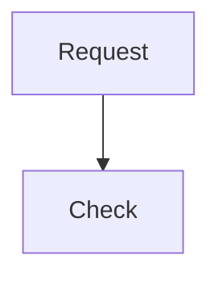
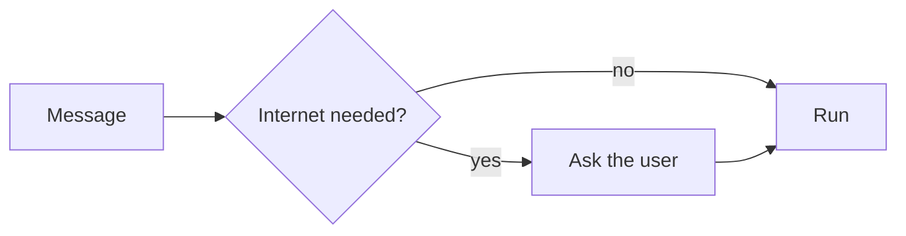
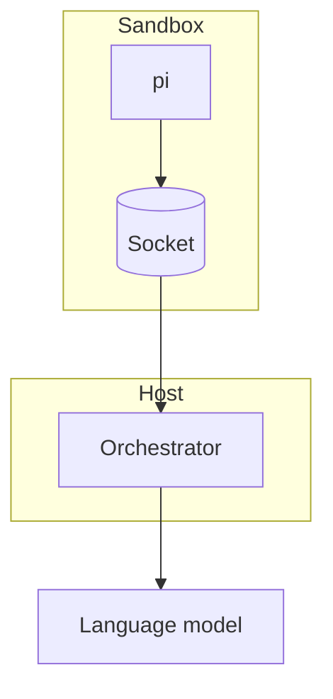
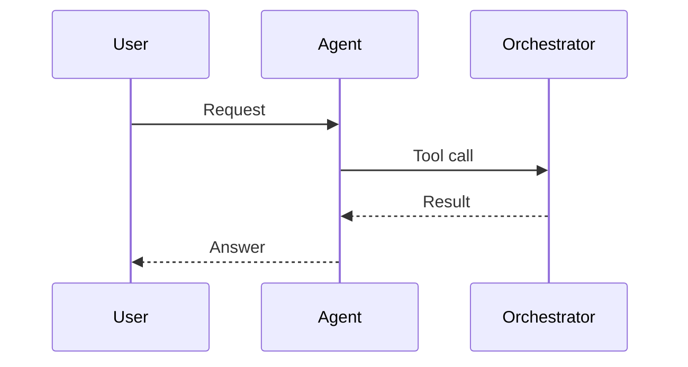
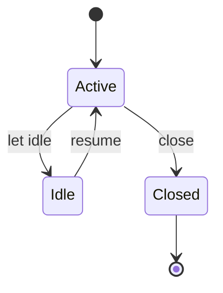
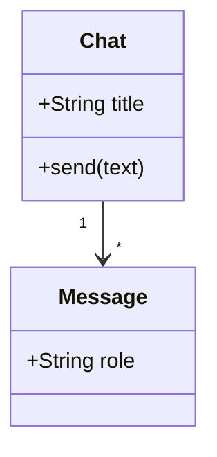
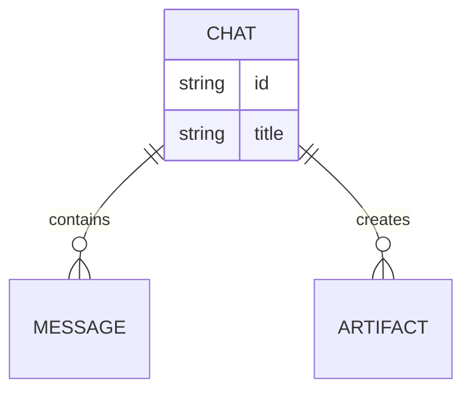
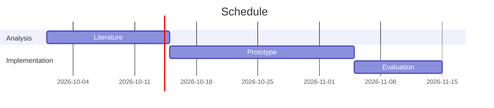
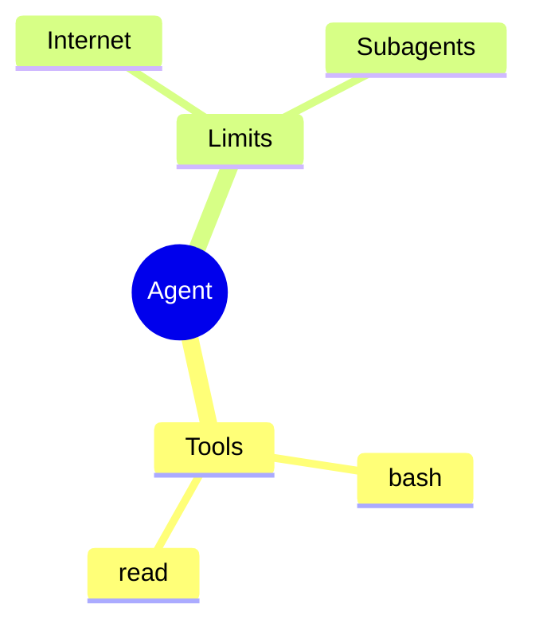
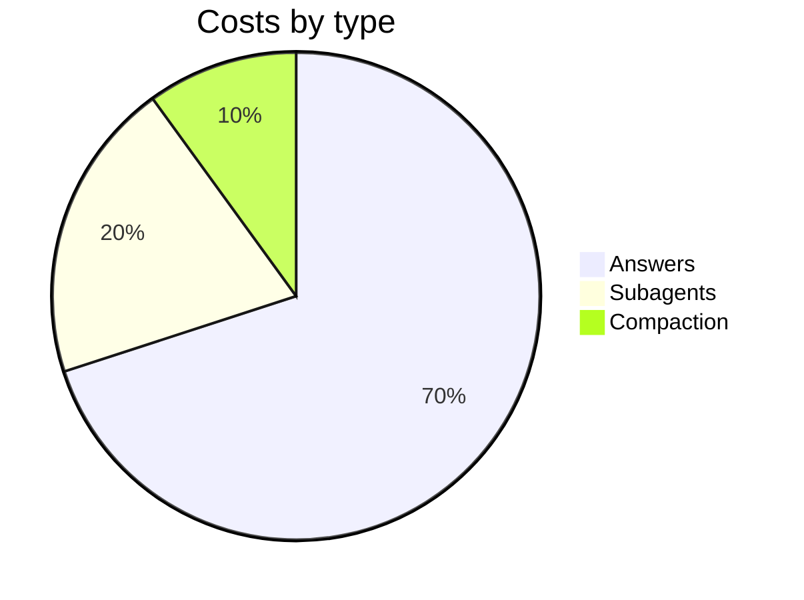

# Showing Mermaid diagrams

## Mermaid or matplotlib?

- **Mermaid** for structure: processes, decisions, architectures, states, message sequences,
  schedules, data models, outlines. No tool, no file needed.
- **matplotlib** (skill `charts`) for **data**: measurements, trends, distributions, anything with axes and
  numbers. A bar chart from a CSV is not a case for Mermaid.

## How to show it

Write the diagram as a code block with the language `mermaid` in the answer:

````markdown

````

The web UI renders the block as soon as it is closed; the user can switch between diagram and
source and enlarge it. **Only the web UI renders**: in the CLI, in artifacts and in
files it stays source text. That is the normal case; you only need a file if the user wants
one.

## If need be as a file: mmdc

If the diagram is to become a file (artifact, Typst document, image with ``), render it
with the Mermaid CLI `mmdc` (version 12, like the web UI; runs without internet, about 1 s per diagram):

```bash
mmdc -i diagram.mmd -o diagram.png          # PNG; also .svg or .pdf
mmdc -i diagram.mmd -o diagram.png -s 2     # double resolution, sharper
mmdc -i report.md -o report.out.md          # replaces all mermaid blocks with SVG files
```

For display in the chat use **PNG** (the web UI does not display SVG), for Typst **SVG** or **PDF**.
Store files under `/workspace`. If the call fails with a syntax error, the line is in
the message; the pitfalls below apply just the same.

One diagram per code block. Keep it small (up to about 20 nodes); better two clear ones than one
unreadable one. A sentence before it says what it shows.

## Pitfalls

- **Labels in quotes** as soon as they contain umlauts, ß, spaces, brackets, colons,
  slashes, `#`, `&` or punctuation: `A["Größe prüfen (m²)"]`, edge text
  `-->|"ja, bestätigt"|`. Write quotes within the text as `#quot;`.
- **Identifiers** (`A`, `check`, `db1`) only from ASCII letters, digits and `_`; no `end` as
  an identifier (keyword), use `End` or `finish` instead.
- **No HTML** in labels (`<br>`, `<b>` …): the UI renders with `securityLevel: "strict"` and
  without HTML labels. For line breaks, prefer shorter labels.
- **No `click` directives, links or callbacks**: they have no effect in strict mode.
- **No `%%{init: …}%%` directives** for theme, font, HTML labels or security: the UI sets them
  itself and ignores changes to them.
- No styles with addresses (`url(...)`) or images from the network; they are removed.
- On a syntax error the UI shows the source with a note. Then look for the error (usually
  missing quotes) and send the corrected block again.

## Common types

**Process** (`flowchart`, direction `TD` top to bottom, `LR` left to right):



**Architecture** (process with groups):



**Sequence:**



**States:**



**Classes:**



**Data model (ER):**



In ER diagrams, relationship names without quotes may only be ASCII; with umlauts, put them in
quotes: `CHAT ||--o{ NACHRICHT : "enthält"`.

**Schedule (Gantt):**



**Mind map** (indentation determines the level):



**Pie** (shares, only for a few values; exact numbers better with matplotlib):


