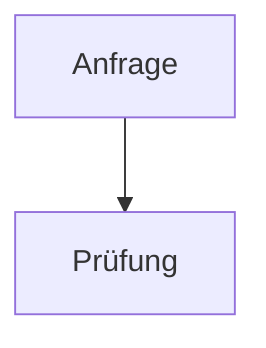
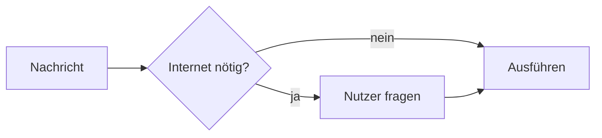
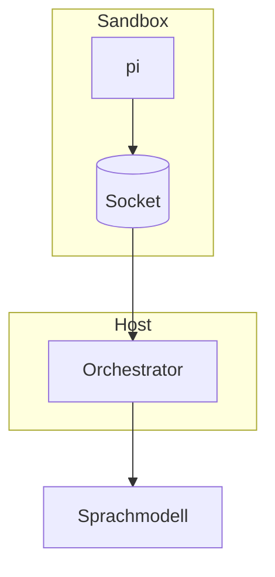
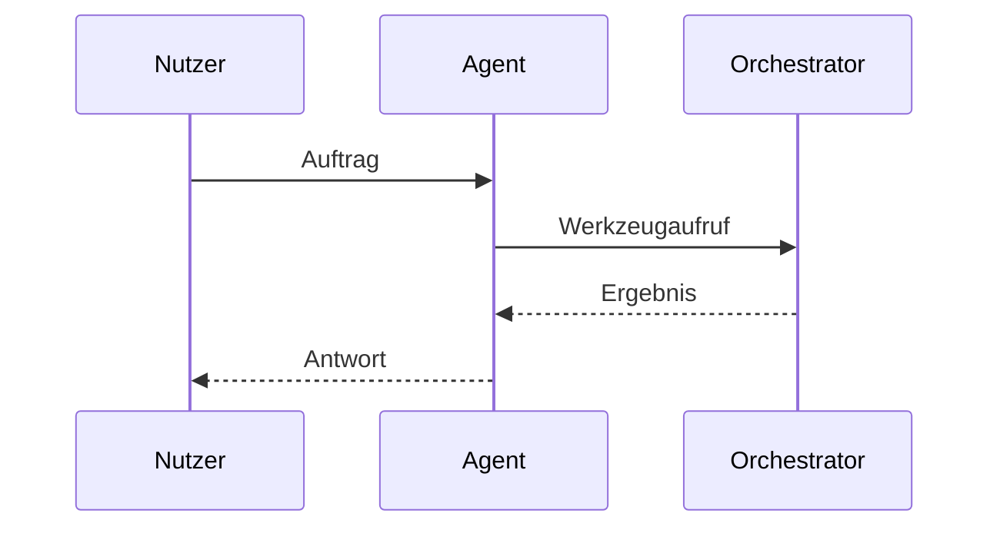
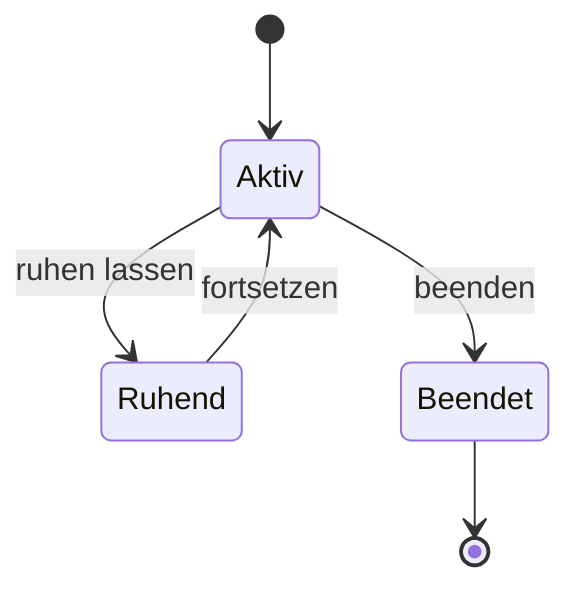
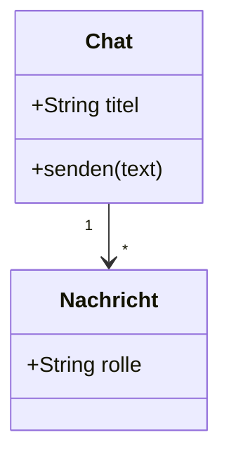
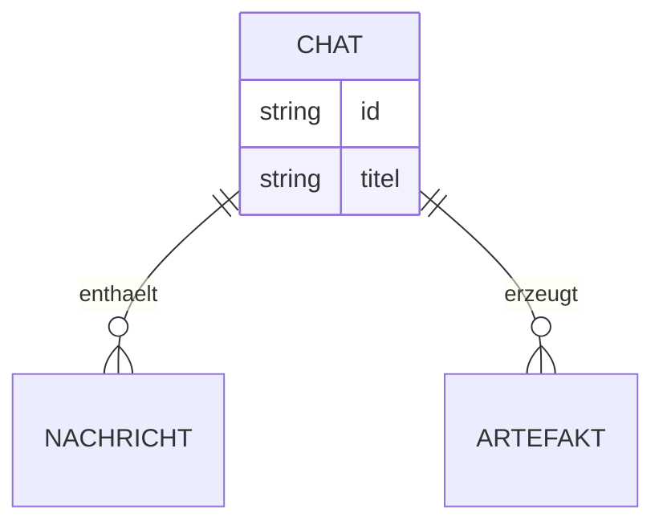
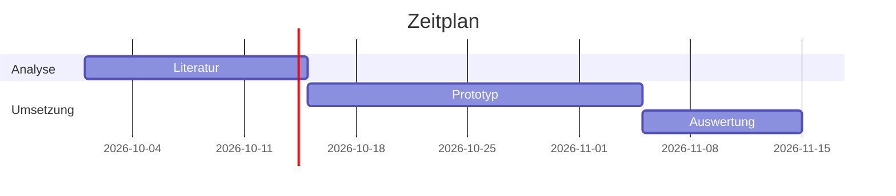
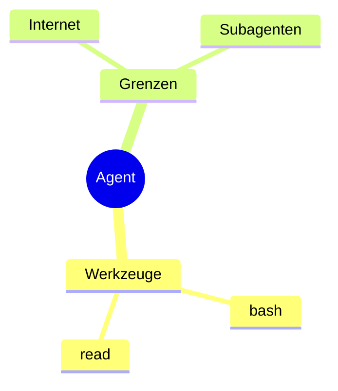
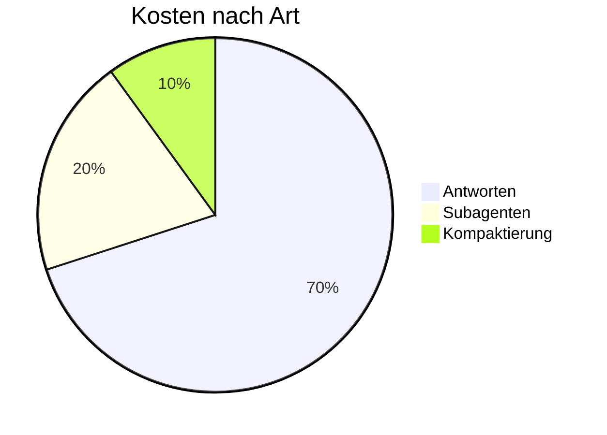

# Mermaid-Diagramme zeigen

## Mermaid oder matplotlib?

- **Mermaid** für Struktur: Abläufe, Entscheidungen, Architekturen, Zustände, Nachrichtenfolgen,
  Zeitpläne, Datenmodelle, Gliederungen. Kein Werkzeug, keine Datei nötig.
- **matplotlib** (Skill `diagramme`) für **Daten**: Messwerte, Verläufe, Verteilungen, alles mit Achsen und
  Zahlen. Ein Balkendiagramm aus einer CSV ist kein Fall für Mermaid.

## So zeigst du es

Schreib das Diagramm als Codeblock mit der Sprache `mermaid` in die Antwort:

````markdown

````

Die Web-UI zeichnet den Block, sobald er geschlossen ist; der Nutzer kann zwischen Diagramm und
Quelltext umschalten und es vergrößern. **Nur die Web-UI zeichnet**: In der CLI, in Artefakten und in
Dateien bleibt es Quelltext. Das ist der Normalfall; eine Datei brauchst du nur, wenn der Nutzer eine
möchte.

## Zur Not als Datei: mmdc

Soll das Diagramm eine Datei werden (Artefakt, Typst-Dokument, Bild mit ``), zeichnest du es
mit der Mermaid-CLI `mmdc` (Version 12, wie die Web-UI; läuft ohne Internet, etwa 1 s je Diagramm):

```bash
mmdc -i diagramm.mmd -o diagramm.png          # PNG; auch .svg oder .pdf
mmdc -i diagramm.mmd -o diagramm.png -s 2     # doppelte Auflösung, schärfer
mmdc -i bericht.md -o bericht.out.md          # ersetzt alle mermaid-Blöcke durch SVG-Dateien
```

Für die Anzeige im Chat nimm **PNG** (SVG zeigt die Web-UI nicht an), für Typst **SVG** oder **PDF**.
Dateien unter `/workspace` ablegen. Scheitert der Aufruf mit einem Syntaxfehler, steht die Zeile in
der Meldung; die Fallstricke unten gelten genauso.

Ein Diagramm je Codeblock. Halte es klein (etwa bis 20 Knoten); lieber zwei übersichtliche als ein
unlesbares. Ein Satz davor sagt, was es zeigt.

## Fallstricke

- **Beschriftungen in Anführungszeichen**, sobald sie Umlaute, ß, Leerzeichen, Klammern, Doppelpunkte,
  Schrägstriche, `#`, `&` oder Satzzeichen enthalten: `A["Größe prüfen (m²)"]`, Kantentext
  `-->|"ja, bestätigt"|`. Anführungszeichen im Text selbst als `#quot;` schreiben.
- **Kennungen** (`A`, `pruefung`, `db1`) nur aus ASCII-Buchstaben, Ziffern und `_`; kein `end` als
  Kennung (Schlüsselwort), sonst `End` oder `ende`.
- **Kein HTML** in Beschriftungen (`<br>`, `<b>` …): Die UI zeichnet mit `securityLevel: "strict"` und
  ohne HTML-Labels. Für Zeilenumbrüche lieber kürzere Beschriftungen.
- **Keine `click`-Direktiven, Links oder Callbacks**: im strikten Modus wirkungslos.
- **Keine `%%{init: …}%%`-Direktiven** für Theme, Schrift, HTML-Labels oder Sicherheit: Die UI setzt sie
  selbst und ignoriert Änderungen daran.
- Keine Stile mit Adressen (`url(...)`) oder Bildern aus dem Netz; sie werden entfernt.
- Bei einem Syntaxfehler zeigt die UI den Quelltext mit Hinweis. Dann den Fehler suchen (meist
  fehlende Anführungszeichen) und den Block korrigiert neu senden.

## Gängige Typen

**Ablauf** (`flowchart`, Richtung `TD` oben nach unten, `LR` links nach rechts):



**Architektur** (Ablauf mit Gruppen):



**Sequenz:**



**Zustände:**



**Klassen:**



**Datenmodell (ER):**



In ER-Diagrammen stehen Beziehungsnamen ohne Anführungszeichen nur in ASCII; mit Umlauten in
Anführungszeichen: `CHAT ||--o{ NACHRICHT : "enthält"`.

**Zeitplan (Gantt):**



**Mindmap** (Einrückung bestimmt die Ebene):



**Kreis** (Anteile, nur für wenige Werte; genaue Zahlen lieber mit matplotlib):


